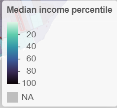
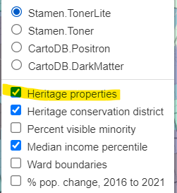
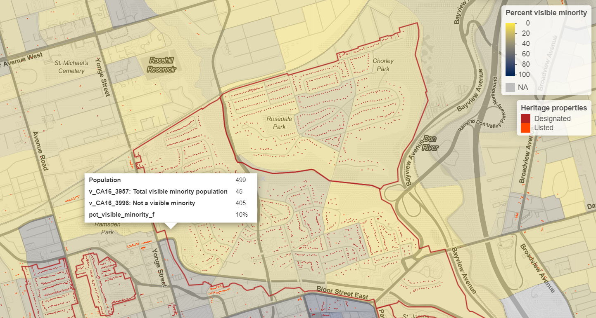
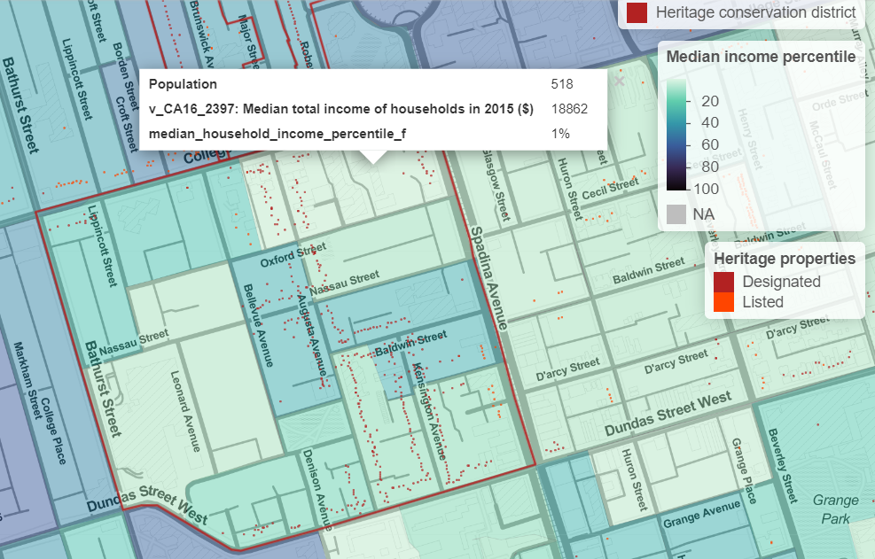
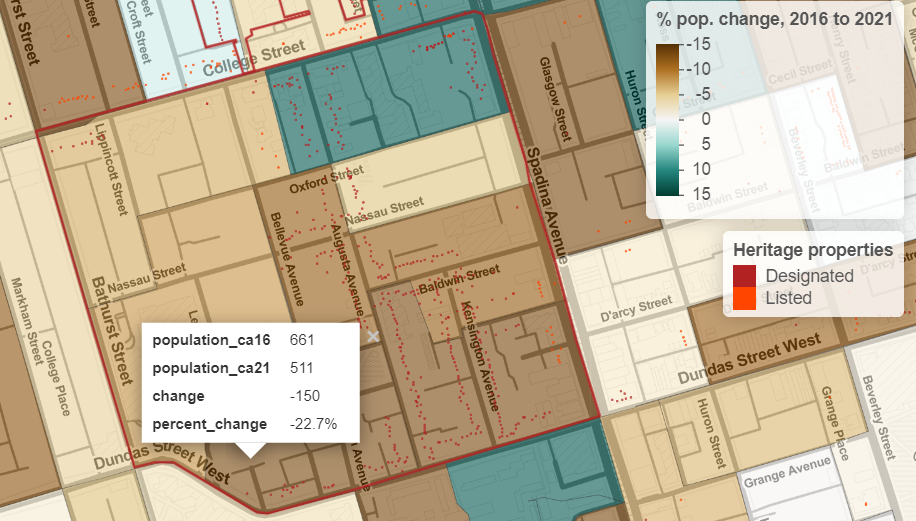
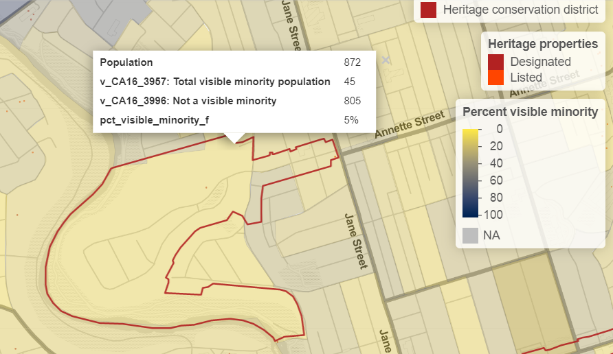
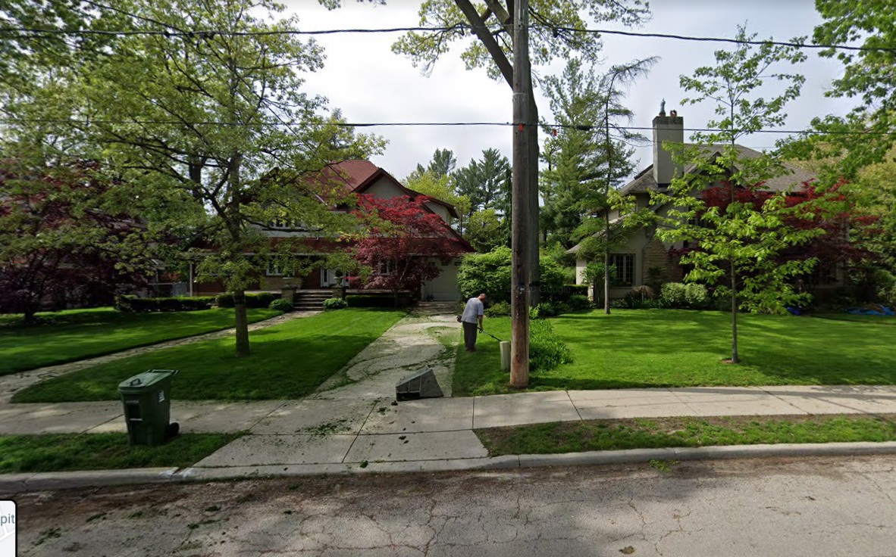

*tl;dr I created an [interactive map](https://jdawang.github.io/heritage/) map showing heritage properties, and heritage conservation districts overlayed on visible minority composition and neighbourhood median income*

## Motivation

In Toronto's housing advocacy circle, we assert that cities abuse heritage listings and subsequent designations to block building housing.
Many dubious properties are heritage listed, including in some cases ["heritage" parking lots](https://twitter.com/HousingNowTO/status/1404471366276030467) and [golf courses](https://twitter.com/SteveClarkPC/status/1511140611574882305).
Council will often [bulk-list](https://twitter.com/mjrichardson_to/status/1407146529459212290) heritage in an area, or designate an entire neighbourhood as a heritage conservation district (HCD), which combined with zoning and built form restrictions will make it almost impossible for development to occur.

There is a class and racial dimension to heritage designations too.
For one, the Toronto Preservation Board, the body in charge of making heritage advice to council, is hardly representative of the demographics of Toronto as a whole.



I wanted to explore which neighbourhoods are considered worthy of heritage protection.
What are the demographics of the people who live there?
Heritage for whom?

I'm no urban geographer, historian, or sociologist, so take my comments with a grain of salt.
I don't know too much about the in-depth histories of the heritage conservation districts and the listed properties, but I'll comment on some highlights.

## Data

[Heritage resgister data](https://open.toronto.ca/dataset/heritage-register/), [heritage conservation district data](https://open.toronto.ca/dataset/heritage-conservation-districts/), and [ward boundaries](https://open.toronto.ca/dataset/city-wards/) come from the City of Toronto's open data portal. 
Visible minority data, household median income, and population growth come from the 2016 and 2021 Statistics Canada censuses, pulled from censusmapper using [`cancensus`](https://mountainmath.github.io/cancensus/index.html) and [`tongfen`](https://github.com/mountainMath/tongfen).

## Map details

On the map, I plotted heritage conservation district boundaries, heritage listed or designated properties, percent population growth from 2016 to 2021, and percent of individuals identifying as a visible minority in 2016, which need no further explanation.
For income, the colour is the median household income percentile among census dissemination areas (DAs) in Toronto.
For example, a value of 90%, corresponding to a relatively darker colour, indicates that 90% of Toronto DAs have a lower median income.
I felt that this kind of transformation produces better colour variation than just raw dollar values.
You can still see median income in dollars by clicking on each DA.

Last technical note, for performance reasons, I plotted the heritage property locations as a `canvas` layer.
In non-tech speak: to keep the heritage property points as the top layer, you have to toggle the "heritage properties" layer each time you switch the heatmap underneath.

## Highlights

### Rosedale

Well-known for being an affluent neighbourhood, Rosedale lives up to its name.
It is extremely white, with some DAs only having 8% of their population identifying as a visible minority.
It is extremely affluent, with median household incomes north of $200,000 in some DAs.
There are some apartments in Rosedale, but most of it are single family homes, despite being located next to multiple subway stations in the middle of Canada's largest city.
The overwhelming majority of properties are heritage designated.
Seriously, looking at the map, almost every single address is heritage designated as part of the heritage conservation district.

While there is more than just heritage designations and heritage conservation districts at work at keeping Rosedale exclusionary, in my opinion, our heritage process is not helping build an inclusive neighbourhood in Rosedale.

### Kensington Market

Kensington Market is an example of the opposite of Rosedale.
Historically, Kensington has been known as a neighbourhood where immigrants have been able to make their start in Toronto.
Gentrification is a concern in Kensington and efforts like the [Kensington Market Community Land Trust](https://kmclt.ca/) aim to keep the area accessible to all.
In 2015, median incomes were in the 30th percentile of DAs in the city or lower and the population of some DAs are up to 73% visible minority identification.

On the other hand, except for that one DA at the corner of College and Spadina, Kensington has lost population from 2016 to 2021.
Keeping built form preserved with heritage might not stop gentrification.
Restrictions on building housing across the city with a growing population mean that some neighbourhoods may just [change from the inside instead of the outside](https://darrellowens.substack.com/p/the-look-of-gentrification).
Heritage only protects aesthetics.

### Baby Point

Baby Point is a heritage conservation district developed ["according to the garden suburb model"](https://www.toronto.ca/city-government/planning-development/planning-studies-initiatives/baby-point-heritage-conservation-district-study/).
Only one property is designated on the heritage register, despite the neighbourhood being a HCD.
The development pattern and properties emphasize the "ample lot size".
As you could guess from that description, this neighbourhood is in the top 1% income-wise and 95% White.

We know that this kind of development pattern is utterly bad planning.
The density is not high enough to sustain good levels of public transit, or create walkable and bikeable communities.
Clearly, this is one of the most exclusive neighbourhoods in the city, with no class, or racial integration whatsoever.
Why are we designating neighbourhoods like this one as "heritage"?
What are we protecting?
Who are we protecting, from what, and from whom?

*My interactive map of heritage in Toronto can be found at [jdawang.github.io/heritage/](https://jdawang.github.io/heritage/)*

*Full code and data can be found on my [GitHub](https://github.com/jdawang/heritage)*
