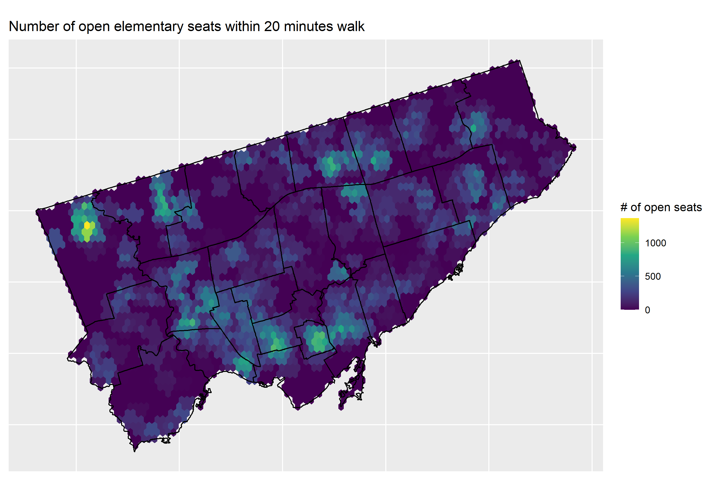

After reading a tweet about using [`r5r`](https://ipeagit.github.io/r5r/) for transit route analysis, I was inspired to try it out. I have always been interested in transit, and so this was an exciting way to marry my interest in data, transit, and cities.

My previous [map](https://jdawang.github.io/tdsb) and post about [TDSB school capacity](/blog/mapping-tdsb/) gives a good idea of where there is excess school capacity, and where capacity is constrained.
But, it relies mostly on the placement of points, and the size of the points to visualize which neighbourhoods have excess school capacity.
With `r5r`, I can add another way of visualizing school capacity: an isochrone map, showing how many empty seats are accessible from locations across Toronto.
All I need to do is download an Open Street Map file for Toronto, and the [TTC's GTFS](https://open.toronto.ca/dataset/ttc-routes-and-schedules/), both open data.

I arbitrarily chose two measures of school accessibility to map, one for elementary schools, and one for secondary schools:

- Number of open elementary school seats accessible within 20 minutes walking
- Number of open secondary school seats accessible within 30 minutes on transit. Assumes that high school students are more likely to be able to take transit on their own.

First up, elementary schools.

First, it's striking just how much of Toronto has zero or close to zero open elementary school seats within walking distance.
This is probably due to a combination of factors, which are not unrelated: low walkability, especially in the suburbs, low population density, and low school capacity.
The most elementary school accessible neighbourhoods are found in the old, established neighbourhoods downtown, which are both walkable, and have excess school capacity.
One theme, at least in Old Toronto, and former York, is that the west end tends to have better school accessbility than the east end.
That being said, there are areas in the suburbs, notably in Don Valley North, Etobicoke North, Weston, and others, that have lots of elementary school accessbility.

Next up, secondary schools.

From this map, it is clear that secondary school accessbility is best in the old, established neighbourhoods in the west end, with the best location being in Ward 9, Davenport.
Similar to elementary school accessibility, from Don Valley North, over to Scarborough Guildwood, as well as in the Northwest suburbs, there are lots of open seats accessible by transit.

I hope that these maps are a useful addition to my previous work.
I have updated my [interactive map](https://jdawang.github.io/tdsb) with these accessbility layers. As always, full code can be found on my [GitHub](https://github.com/jdawang/tdsb).
