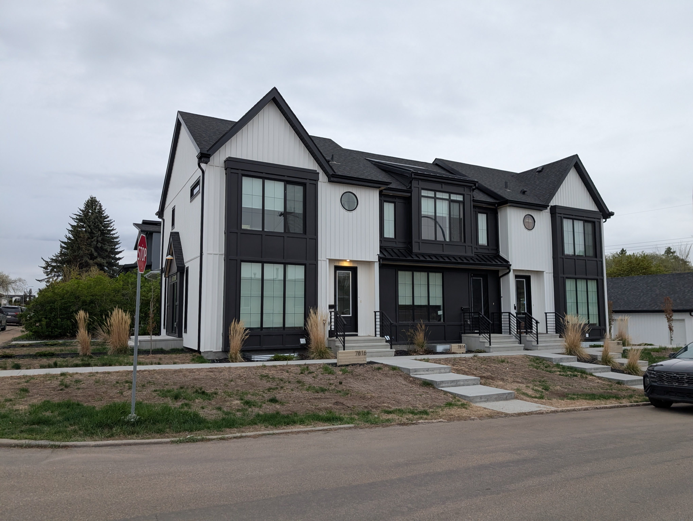

It's July, so it's time for another check-in on building permits in Edmonton. 2025 was a [record year](../zbr-two-year-review/index.qmd) for the missing middle and [Q1 2026](../q1-building-permits/index.qmd) looked like it might continue that momentum. With a full six months of data now in hand, the picture has shifted: overall permit activity has slowed, driven by a lull in large apartment projects. But look past the apartment category, and the RS Zone rowhome story keeps getting stronger.

In the rest of this post, I compare H1 2026 permits year-over-year against prior H1s, project what a full 2026 might look like if this pace holds, look at which neighbourhoods are seeing the most RS Zone infill, and check whether Edmonton is continuing to build close to transit. New this quarter, I took a look at the cumulative number of homes permitted since the RS Zone took effect in January 2024, and how that supply is distributed across neighbourhood types. I also added a look at frequent bus walksheds and if rowhomes are built close to the frequent bus network.

{#fig-rowhouse-image fig-alt="A rowhouse in Forest Heights" width="538"}

## Key facts

```{r}
#| label: key-facts-setup
#| include: false
library(tidyverse)
library(sf)
library(gt)
library(mountainmathHelpers)
library(tidytransit)
library(jdawangHelpers)
options(
  cancensus.api_key = Sys.getenv("CM_API_KEY"),
  cancensus.cache_path = Sys.getenv("CM_CACHE_PATH"),
  tongfen.cache_path = Sys.getenv("TONGFEN_CACHE_PATH"),
  nextzen_API_key = Sys.getenv("NEXTZEN_API_KEY")
)

bp_raw <- get_edmonton_building_permit_data(
  cache_dir = Sys.getenv("EDMONTON_BP_CACHE_PATH")
)
crs <- lambert_conformal_conic_at(bp_raw)
bp_raw <- st_transform(bp_raw, crs)

bp <- bp_raw |>
  filter(year < 2026 | (year == 2026 & month_number <= 6)) |>
  filter_edmonton_residential() |>
  filter(units_added >= 1, work_type != "(04) Excavation") |>
  add_edmonton_project_type() |>
  add_edmonton_suite_info() |>
  add_edmonton_neighbourhood_type()

# H1 data for all years (for YoY comparison and transit)
bp_h1 <- bp |> filter(month_number <= 6)

# Historical H1 vs full-year ratios (for multiplier)
h1_ratios <- bp |>
  st_drop_geometry() |>
  filter(year < 2026) |>
  group_by(year) |>
  summarize(
    full_year = sum(units_added),
    h1 = sum(units_added[month_number <= 6]),
    .groups = "drop"
  ) |>
  mutate(ratio = full_year / h1)

h1_multiplier <- round(median(h1_ratios$ratio), 1)

# H1 2026 totals
h1_2026_total <- bp_h1 |>
  st_drop_geometry() |>
  filter(year == 2026) |>
  summarize(total = sum(units_added)) |>
  pull(total)

h1_2025_total <- bp_h1 |>
  st_drop_geometry() |>
  filter(year == 2025) |>
  summarize(total = sum(units_added)) |>
  pull(total)

yoy_pct <- round((h1_2026_total / h1_2025_total - 1) * 100, 1)
annualized_2026 <- round(h1_2026_total * h1_multiplier)

# Transit proximity for H1 2026
future_stops <- read_sf("../../../data/future_lrt_stops.geojson") |>
  filter(
    !(stop_name %in%
      c(
        "Castle Downs Station",
        "145 Ave Station",
        "137 Ave Station",
        "132 Ave Station"
      ))
  )

transit_stops <- load_edmonton_transit_stops(
  gtfs_path = "../../../data/ca-alberta-edmonton-transit-system-gtfs-714.zip",
  service_date = as.Date("2023-11-09"),
  future_stops = future_stops,
  crs = crs
)

pct_800m_h1_2026 <- bp_h1 |>
  filter(year == 2026, !st_is_empty(geometry)) |>
  add_transit_distance(transit_stops) |>
  st_drop_geometry() |>
  summarize(
    pct = sum(units_added[distance_from_lrt <= 0.8]) / sum(units_added)
  ) |>
  pull(pct)

pct_800m_2025 <- bp |>
  filter(year == 2025, !st_is_empty(geometry)) |>
  add_transit_distance(transit_stops) |>
  st_drop_geometry() |>
  summarize(
    pct = sum(units_added[distance_from_lrt <= 0.8]) / sum(units_added)
  ) |>
  pull(pct)

# Top project type in H1 2026
top_project_type <- bp_h1 |>
  st_drop_geometry() |>
  filter(year == 2026) |>
  group_by(project_type) |>
  summarize(total = sum(units_added), .groups = "drop") |>
  slice_max(total, n = 1) |>
  pull(project_type)
```

- Edmonton issued building permits for **`r scales::comma(h1_2026_total)`** homes in H1 2026. Annualized, that projects to roughly **`r scales::comma(annualized_2026)`** homes for the full year.

- Homes permitted in H1 2026 is **`r abs(yoy_pct)`%`r if(yoy_pct >= 0) " higher" else " lower"`** than H1 2025, when `r scales::comma(h1_2025_total)` homes were permitted.

- **`r top_project_type`** projects led all categories by homes added in H1 2026.

- **`r scales::percent(pct_800m_h1_2026, accuracy=1)`** of homes were permitted within 800m of an existing or under-construction LRT stop in H1 2026, compared to `r scales::percent(pct_800m_2025, accuracy=1)` in 2025 (full year).

## Data

```{r}
#| label: data-load
# bp, bp_h1, transit_stops are already loaded in key-facts-setup chunk above

# Assessment data for neighbourhood tables
assessment_rs <- read_sf(
  "../../../data/Property Information (Current Calendar Year)_20260113/"
) |>
  st_drop_geometry() |>
  rename(
    house_number = house_numb,
    street_name = street_nam,
    neighbourhood = neighbou_2
  ) |>
  filter(zoning == "RS", !is.na(house_number)) |>
  distinct(house_number, street_name, .keep_all = TRUE)

# Neighbourhood → neighbourhood_type lookup from bp
nbhd_type_lookup <- bp |>
  st_drop_geometry() |>
  distinct(neighbourhood, neighbourhood_type) |>
  filter(!is.na(neighbourhood_type))

assessment_rs <- assessment_rs |>
  left_join(nbhd_type_lookup, by = "neighbourhood")

# Population and ward data
wards <- read_sf(
  "../../../data/City_of_Edmonton_-_Neighbourhoods_20260417.geojson"
) |>
  st_drop_geometry() |>
  select(neighbourhood = name, Ward = civic_ward_name)

population_1971 <- read_csv(
  "../../../data/population_1971.csv",
  show_col_types = FALSE
) |>
  select(neighbourhood = Neighbourhood, n_1971 = `Total - Age`)

population_2021 <- read_csv(
  "../../../data/population_2021.csv",
  show_col_types = FALSE
) |>
  distinct() |>
  rename(neighbourhood = NEIGHBOURHOOD, n_2021 = `2021`)

population_change <- population_2021 |>
  full_join(population_1971, by = "neighbourhood") |>
  left_join(wards, by = "neighbourhood") |>
  replace_na(list(n_2021 = 0, n_1971 = 0)) |>
  mutate(pct_change = n_2021 / n_1971 - 1)
```

Edmonton's [general building permit data](https://data.edmonton.ca/Urban-Planning-Economy/General-Building-Permits/24uj-dj8v/about_data) tracks building permits since 2009, with columns for building type, work type, location, units added, and more. Unlike the [Q1 post](../q1-building-permits/index.qmd), which used a manually downloaded shapefile snapshot, this post fetches permit data directly from Edmonton's Open Data API, filtered to H1 (January through June) to exclude incomplete July data.

Edmonton's [property assessment data](https://data.edmonton.ca/City-Administration/Property-Assessment-Data-Current-Calendar-Year-/q7d6-ambg/about_data) provides one row per property with zoning and neighbourhood information, used to calculate how many RS-zoned properties exist per neighbourhood.

For background on the RS Zone and ZBR, see the [two-year review post](../zbr-two-year-review/index.qmd).

Similar to my [Q1 post](../q1-building-permits/index.qmd), to annualize the 2026 H1 numbers to the full year, I estimate an annualization multiplier from historical data. For each year from 2009 to 2025, I calculate the ratio of full-year units to H1 units, and use the median as the multiplier.

```{r}
#| label: fig-h1-multiplier
#| fig-cap: "Historical ratio of full-year to H1 residential building permit units"
ggplot(h1_ratios, aes(x = year, y = ratio)) +
  geom_line(linewidth = 1) +
  geom_point() +
  geom_hline(
    yintercept = h1_multiplier,
    linetype = "dashed",
    colour = "grey60"
  ) +
  annotate(
    "text",
    x = 2015,
    y = h1_multiplier + 0.3,
    label = paste0("Median: ", h1_multiplier),
    size = 3.5
  ) +
  labs(
    title = "Ratio of full-year to H1 residential building permit units",
    subtitle = "2009-2025",
    x = "Year",
    y = "Full-year / H1 ratio",
    caption = CAPTION_COE
  ) +
  theme_jd(mode = "light")
```

The median H1 multiplier is `r h1_multiplier`×, as shown in @fig-h1-multiplier, meaning a full year typically produces `r h1_multiplier` times the homes permitted in H1 alone. All 2026 projections in this post use this multiplier.

## Year-over-year H1 comparison

The most direct way to compare H1 2026 to prior years is to look at H1 data across all years, stripping out seasonality entirely. @fig-h1-yoy-units shows units added in H1 for each year since 2009, broken down by project type. The overall dip is visible, but it's driven by the 9+ Apartment category, can vary year to year depending on when a handful of large projects happen to get building permits. The 5-8 unit rowhome, by contrast, keeps climbing, continuing the trend we've seen since ZBR came into effect.

```{r}
#| label: fig-h1-yoy-units
#| fig-cap: "Total homes permitted in H1 by project type, 2009–2026"
#| fig-subcap: ["Line plot", "Area plot"]
h1_by_type <- bp_h1 |>
  st_drop_geometry() |>
  group_by(year, project_type, .drop = FALSE) |>
  summarize(total = sum(units_added), num_projects = n(), .groups = "drop")

ggplot(h1_by_type, aes(x = year, y = total, colour = project_type)) +
  geom_line(linewidth = 1) +
  geom_point() +
  scale_y_continuous(labels = scales::label_comma()) +
  labs(
    title = "Homes permitted by project type",
    subtitle = "H1 building permits, 2009–2026",
    colour = "Project type",
    x = "Year",
    y = "Homes permitted",
    caption = CAPTION_COE
  ) +
  theme_jd(mode = "light")

ggplot(h1_by_type, aes(x = year, y = total, fill = project_type)) +
  geom_area() +
  scale_y_continuous(labels = scales::label_comma()) +
  labs(
    title = "Homes permitted by project type",
    subtitle = "H1 building permits, 2009–2026",
    fill = "Project type",
    x = "Year",
    y = "Homes permitted",
    caption = CAPTION_COE
  ) +
  theme_jd(mode = "light")
```

@fig-h1-yoy-permits shows the same H1 data as raw permit counts rather than units, a complementary view for understanding how many discrete projects are driving each category.

```{r}
#| label: fig-h1-yoy-permits
#| fig-cap: "Number of building permits issued in H1 by project type, 2009–2026"
#| fig-subcap: ["Line plot", "Area plot"]
ggplot(h1_by_type, aes(x = year, y = num_projects, colour = project_type)) +
  geom_line(linewidth = 1) +
  geom_point() +
  scale_y_continuous(labels = scales::label_comma()) +
  labs(
    title = "Building permits issued by project type",
    subtitle = "H1 building permits, 2009–2026",
    colour = "Project type",
    x = "Year",
    y = "Number of permits",
    caption = CAPTION_COE
  ) +
  theme_jd(mode = "light")

ggplot(h1_by_type, aes(x = year, y = num_projects, fill = project_type)) +
  geom_area() +
  scale_y_continuous(labels = scales::label_comma()) +
  labs(
    title = "Building permits issued by project type",
    subtitle = "H1 building permits, 2009–2026",
    fill = "Project type",
    x = "Year",
    y = "Number of permits",
    caption = CAPTION_COE
  ) +
  theme_jd(mode = "light")
```

Looking at the number of homes by neighbourhood type, @fig-h1-yoy-nbhd shows that mature neighbourhoods held up best in H1 2026, again driven by the 5-8 unit rowhome. The areas between the mature core and the Henday saw the sharpest pullback, largely reflecting fewer large apartment permits in those neighbourhoods this year so far.

```{r}
#| label: fig-h1-yoy-nbhd
#| fig-cap: "Total homes permitted in H1 by neighbourhood type, 2009–2026"
#| fig-subcap: ["Line plot", "Area plot"]
h1_by_nbhd_type <- bp_h1 |>
  st_drop_geometry() |>
  filter(!is.na(neighbourhood_type)) |>
  group_by(year, neighbourhood_type, project_type, .drop = FALSE) |>
  summarize(total = sum(units_added), .groups = "drop")

ggplot(h1_by_nbhd_type, aes(x = year, y = total, colour = project_type)) +
  geom_line(linewidth = 1) +
  geom_point() +
  scale_y_continuous(labels = scales::label_comma()) +
  facet_wrap(vars(neighbourhood_type)) +
  labs(
    title = "Homes permitted by neighbourhood type and project type",
    subtitle = "H1 building permits, 2009–2026",
    colour = "Project type",
    x = "Year",
    y = "Homes permitted",
    caption = CAPTION_COE
  ) +
  theme_jd(mode = "light")

ggplot(h1_by_nbhd_type, aes(x = year, y = total, fill = project_type)) +
  geom_area() +
  scale_y_continuous(labels = scales::label_comma()) +
  facet_wrap(vars(neighbourhood_type)) +
  labs(
    title = "Homes permitted by neighbourhood type and project type",
    subtitle = "H1 building permits, 2009–2026",
    fill = "Project type",
    x = "Year",
    y = "Homes permitted",
    caption = CAPTION_COE
  ) +
  theme_jd(mode = "light")
```

## Projecting 2026 from H1 data

With half of the year under our belt, we can make a good guess as to how the rest of the year is trending. \@fig-annualized-units shows the full-year units added by project type, with 2026 projected from H1 using the `r h1_multiplier`× adjustment.

The total projection lands below 2025's record, closer to 2024 levels. That's still a strong year, just not another record. As always, a handful of large apartment projects in the second half of the year could move this projection significantly.

```{r}
#| label: fig-annualized-units
#| fig-cap: "Total homes permitted by project type, 2009–2025 (full year) and 2026 (projected from H1)"
#| fig-subcap: ["Line plot", "Area plot"]
annual_by_type <- bp |>
  st_drop_geometry() |>
  filter(year < 2026) |>
  group_by(year, project_type, .drop = FALSE) |>
  summarize(total = sum(units_added), num_projects = n(), .groups = "drop")

projected_2026 <- bp_h1 |>
  st_drop_geometry() |>
  filter(year == 2026) |>
  group_by(year, project_type, .drop = FALSE) |>
  summarize(
    total = sum(units_added) * h1_multiplier,
    num_projects = n() * h1_multiplier,
    .groups = "drop"
  ) |>
  mutate(projected = TRUE)

plot_data <- bind_rows(
  mutate(annual_by_type, projected = FALSE),
  projected_2026
)

ggplot(plot_data, aes(x = year, y = total, colour = project_type)) +
  geom_line(linewidth = 1) +
  geom_point() +
  scale_y_continuous(labels = scales::label_comma()) +
  labs(
    title = "Homes permitted by project type",
    subtitle = paste0(
      "Full year 2009–2025; 2026 projected from H1 (×",
      h1_multiplier,
      ")"
    ),
    colour = "Project type",
    x = "Year",
    y = "Homes permitted",
    caption = CAPTION_COE
  ) +
  theme_jd(mode = "light")

ggplot(plot_data, aes(x = year, y = total, fill = project_type)) +
  geom_area() +
  scale_y_continuous(labels = scales::label_comma()) +
  labs(
    title = "Homes permitted by project type",
    subtitle = paste0(
      "Full year 2009–2025; 2026 projected from H1 (×",
      h1_multiplier,
      ")"
    ),
    fill = "Project type",
    x = "Year",
    y = "Homes permitted",
    caption = CAPTION_COE
  ) +
  theme_jd(mode = "light")
```

@fig-annualized-nbhd breaks the same projection down by neighbourhood type. Mature neighbourhoods are still projected to drive a significant amount of Edmonton's housing supply, driven by by the 5-8 unit rowhome category. While there has been anecdotes and discourse on social media about landlords of new rowhomes needing to lower rent to find tenants, it seems like we have not yet hit the rent floor where building permits will slow down. We are still playing catchup on years of suppressed demand to live centrally.

The slowdown shows up mostly outside the mature core, where the apartment pipeline has thinned out this year. Nevertheless, the supply of homes outside the Henday is on track to remain relatively strong.

```{r}
#| label: fig-annualized-nbhd
#| fig-cap: "Homes permitted by neighbourhood type, 2009–2025 (full year) and 2026 (projected from H1)"
#| fig-subcap: ["Line plot", "Area plot"]
#| classes: preview-image
annual_nbhd <- bp |>
  st_drop_geometry() |>
  filter(year < 2026, !is.na(neighbourhood_type)) |>
  group_by(year, neighbourhood_type, project_type, .drop = FALSE) |>
  summarize(total = sum(units_added), .groups = "drop") |>
  mutate(projected = FALSE)

projected_2026_nbhd <- bp_h1 |>
  st_drop_geometry() |>
  filter(year == 2026, !is.na(neighbourhood_type)) |>
  group_by(year, neighbourhood_type, project_type, .drop = FALSE) |>
  summarize(total = sum(units_added) * h1_multiplier, .groups = "drop") |>
  mutate(projected = TRUE)

plot_nbhd <- bind_rows(annual_nbhd, projected_2026_nbhd)

ggplot(plot_nbhd, aes(x = year, y = total, colour = project_type)) +
  geom_line(linewidth = 1) +
  geom_point() +
  scale_y_continuous(labels = scales::label_comma()) +
  facet_wrap(vars(neighbourhood_type)) +
  labs(
    title = "Homes permitted by neighbourhood type and project type",
    subtitle = paste0(
      "Full year 2009–2025; 2026 projected from H1 (×",
      h1_multiplier,
      ")"
    ),
    colour = "Project type",
    x = "Year",
    y = "Homes permitted",
    caption = CAPTION_COE
  ) +
  theme_jd(mode = "light")

ggplot(plot_nbhd, aes(x = year, y = total, fill = project_type)) +
  geom_area() +
  scale_y_continuous(labels = scales::label_comma()) +
  facet_wrap(vars(neighbourhood_type)) +
  labs(
    title = "Homes permitted by neighbourhood type and project type",
    subtitle = paste0(
      "Full year 2009–2025; 2026 projected from H1 (×",
      h1_multiplier,
      ")"
    ),
    fill = "Project type",
    x = "Year",
    y = "Homes permitted",
    caption = CAPTION_COE
  ) +
  theme_jd(mode = "light")
```

## Cumulative homes since the RS Zone took effect

Year-over-year comparisons and full-year projections are useful for tracking momentum, but they don't answer a simpler question: how many homes has the RS Zone actually delivered since it took effect? @fig-cumulative-nbhd tracks the running total of homes permitted each month since January 2024, split by neighbourhood type.

```{r}
#| label: fig-cumulative-nbhd
#| fig-cap: "Cumulative homes permitted by neighbourhood type since the RS Zone took effect (Jan 2024)"
cumulative_since_zbr <- bp |>
  st_drop_geometry() |>
  filter(year >= 2024, !is.na(neighbourhood_type)) |>
  mutate(month = make_date(year, month_number, 1)) |>
  group_by(neighbourhood_type, month) |>
  summarize(units = sum(units_added), .groups = "drop") |>
  complete(
    neighbourhood_type,
    month = seq(make_date(2024, 1, 1), make_date(2026, 6, 1), by = "month"),
    fill = list(units = 0)
  ) |>
  arrange(month) |>
  group_by(neighbourhood_type) |>
  mutate(cumulative = cumsum(units)) |>
  ungroup()

total_homes_since_zbr <- cumulative_since_zbr |>
  filter(month == max(month)) |>
  summarize(total = sum(cumulative)) |>
  pull(total)

mature_share_since_zbr <- cumulative_since_zbr |>
  filter(month == max(month)) |>
  summarize(
    pct = cumulative[neighbourhood_type == "Mature"] / sum(cumulative)
  ) |>
  pull(pct)

ggplot(
  cumulative_since_zbr,
  aes(x = month, y = cumulative, colour = neighbourhood_type)
) +
  geom_line(linewidth = 1) +
  scale_x_date(date_labels = "%b %Y", date_breaks = "6 months") +
  scale_y_continuous(labels = scales::label_comma()) +
  labs(
    title = "Cumulative homes permitted since the RS Zone took effect",
    subtitle = "By neighbourhood type, Jan 2024 – Jun 2026",
    colour = "Neighbourhood type",
    x = NULL,
    y = "Cumulative homes permitted",
    caption = CAPTION_COE
  ) +
  theme_jd(mode = "light")
```

Outside Henday still adds the most homes in raw terms, no surprise, since suburban subdivisions have plenty of vacant land left to build on. But watch the shape of the lines: mature neighbourhoods durably overtook the areas between the mature core and the Henday back in March 2025, and have kept climbing at a steeper pace ever since. Since January 2024, Edmonton has permitted `r scales::comma(total_homes_since_zbr)` homes, and `r scales::percent(mature_share_since_zbr, accuracy=1)` of them landed in mature neighbourhoods.

## Top neighbourhoods for RS infill

Where is the infill actually happening? And how does the level of activity compare to the total number of properties in each neighbourhood?

@tbl-rs-nbhd-type shows the H1 2026 5–8 unit RS Zone permit activity by neighbourhood type, compared to the total number of RS-zoned properties. Even cumulatively over six months, the share of properties being redeveloped remains small. Once again: incremental growth.

```{r}
#| label: tbl-rs-nbhd-type
#| tbl-cap: "RS Zone 5–8 unit permits vs total properties by neighbourhood type, H1 2026"
n_plexes_h1_2026 <- bp_h1 |>
  st_drop_geometry() |>
  filter(
    year == 2026,
    zoning == "RS",
    between(units_added, 5, 8)
  ) |>
  group_by(neighbourhood_type) |>
  summarize(
    n_permits = n(),
    total_units = sum(units_added),
    .groups = "drop"
  ) |>
  mutate(
    n_permits_projected = n_permits * h1_multiplier,
    total_units_projected = total_units * h1_multiplier
  )

n_assessed_rs_by_type <- assessment_rs |>
  filter(!is.na(neighbourhood_type)) |>
  group_by(neighbourhood_type) |>
  summarize(n_properties = n(), .groups = "drop")


n_assessed_rs_by_type |>
  left_join(n_plexes_h1_2026, by = "neighbourhood_type") |>
  replace_na(list(
    n_permits = 0,
    total_units = 0,
    n_permits_projected = 0,
    total_units_projected = 0
  )) |>
  mutate(
    pct = n_permits / n_properties,
    pct_projected = n_permits_projected / n_properties
  ) |>
  gt() |>
  cols_move(n_properties, after = n_permits) |>
  cols_move(pct, after = n_properties) |>
  cols_move(pct_projected, after = n_permits_projected) |>
  cols_align("left", columns = neighbourhood_type) |>
  fmt_percent(columns = c(pct, pct_projected), decimals = 2) |>
  fmt_integer(
    columns = c(
      n_permits,
      n_properties,
      total_units,
      n_permits_projected,
      total_units_projected,
    )
  ) |>
  cols_label(
    neighbourhood_type = "Neighbourhood type",
    n_properties = "RS-zoned properties",
    n_permits = "Permits",
    total_units = "Homes added",
    pct = "% redeveloped",
    n_permits_projected = "Permits",
    total_units_projected = "Homes added",
    pct_projected = "% redeveloped",
  ) |>
  tab_spanner(label = "H1 2026", columns = c(n_permits, total_units, pct)) |>
  tab_spanner(
    label = paste0("Projected 2026 (H1 ×", h1_multiplier, ")"),
    columns = c(n_permits_projected, total_units_projected, pct_projected)
  ) |>
  tab_header(
    title = "RS Zone intensity by neighbourhood type",
    subtitle = "H1 2026, and projected 2026"
  ) |>
  finalize_gt() |>
  opt_stylize_jd()
```

@tbl-top-neighbourhoods shows the top neighbourhoods by H1 2026 5–8 unit RS permit volume. These are the neighbourhoods where ZBR's effects are most visible right now. The west end neighbourhoods along the Valley Line West, and Prince Charles, continue to be popular, but as we will see in a map in @sec-transit, we're starting to see more development along the already-completed Valley Line East.

```{r}
#| label: tbl-top-neighbourhoods
#| tbl-cap: "Top neighbourhoods by H1 2026 5–8 unit RS permits"
#| column: page
n_rs_by_nbhd <- assessment_rs |>
  group_by(neighbourhood) |>
  summarize(n_properties = n(), .groups = "drop")

h1_2026_plexes_by_nbhd <- bp_h1 |>
  st_drop_geometry() |>
  filter(
    year == 2026,
    zoning == "RS",
    between(units_added, 5, 8)
  ) |>
  group_by(neighbourhood) |>
  summarize(n_permits = n(), units_added = sum(units_added), .groups = "drop")

h1_2026_plexes_by_nbhd |>
  left_join(n_rs_by_nbhd, by = "neighbourhood") |>
  left_join(population_change, by = "neighbourhood") |>
  mutate(
    neighbourhood = str_to_title(neighbourhood),
    pct_redevelop = n_permits / n_properties
  ) |>
  slice_max(n_permits, n = 5) |>
  arrange(desc(n_permits)) |>
  select(-Ward) |>
  gt() |>
  cols_move(n_properties, after = n_permits) |>
  cols_move(pct_redevelop, after = n_properties) |>
  cols_move(units_added, after = pct_redevelop) |>
  cols_label(
    neighbourhood = "Neighbourhood",
    n_permits = "Permits",
    units_added = "Homes added",
    n_properties = "RS properties",
    pct_redevelop = "% redeveloped",
    n_2021 = "Population 2021",
    n_1971 = "Population 1971",
    pct_change = "Pop. change"
  ) |>
  fmt_integer(
    columns = c(n_permits, units_added, n_properties, n_2021, n_1971)
  ) |>
  fmt_percent(columns = c(pct_redevelop, pct_change), decimals = 1) |>
  tab_header(
    title = "Top neighbourhoods by H1 2026 5–8 unit RS permits",
    subtitle = "H1 2026 building permits"
  ) |>
  finalize_gt() |>
  opt_stylize_jd()
```

Of course, @tbl-selected-neighbourhoods is the usual table for selected neighbourhoods that have been prominent in debates about RS Zone infill. Another 0.3% of properties redeveloped in Crestwood!

```{r}
#| label: tbl-selected-neighbourhoods
#| tbl-cap: "Selected neighbourhood 5–8 unit RS profiles, H1 2026"
#| column: page
selected_nbhds <- c(
  "GLENWOOD",
  "GROVENOR",
  "BRITANNIA YOUNGSTOWN",
  "WESTMOUNT",
  "MCKERNAN",
  "BELGRAVIA",
  "CRESTWOOD",
  "PARKVIEW"
)

h1_2026_plexes_by_nbhd |>
  right_join(
    tibble(neighbourhood = selected_nbhds),
    by = "neighbourhood"
  ) |>
  replace_na(list(n_permits = 0, units_added = 0)) |>
  left_join(n_rs_by_nbhd, by = "neighbourhood") |>
  left_join(population_change, by = "neighbourhood") |>
  mutate(
    neighbourhood = str_to_title(neighbourhood),
    pct_redevelop = n_permits / n_properties
  ) |>
  select(-Ward) |>
  arrange(neighbourhood) |>
  gt() |>
  cols_move(n_properties, after = n_permits) |>
  cols_move(pct_redevelop, after = n_properties) |>
  cols_move(units_added, after = pct_redevelop) |>
  cols_label(
    neighbourhood = "Neighbourhood",
    n_permits = "Permits",
    units_added = "Homes added",
    n_properties = "RS properties",
    pct_redevelop = "% redeveloped",
    n_2021 = "Population 2021",
    n_1971 = "Population 1971",
    pct_change = "Pop. change"
  ) |>
  fmt_integer(
    columns = c(n_permits, units_added, n_properties, n_2021, n_1971)
  ) |>
  fmt_percent(columns = c(pct_redevelop, pct_change), decimals = 1) |>
  tab_header(
    title = "Selected neighbourhood 5–8 unit RS profiles",
    subtitle = "H1 2026 building permits"
  ) |>
  finalize_gt() |>
  opt_stylize_jd()
```

@tbl-cumulative-neighbourhoods is an interactive table with cumulative 2024 + 2025 + H1 2026 activity for all neighbourhoods. You can search for your neighbourhood, or sort by any column.

```{r}
#| label: tbl-cumulative-neighbourhoods
#| tbl-cap: "Cumulative RS infill by neighbourhood, 2024–H1 2026 (interactive)"
#| column: page
cumulative_plexes_by_nbhd <- bp |>
  st_drop_geometry() |>
  filter(
    year >= 2024,
    zoning == "RS",
    between(units_added, 5, 8)
  ) |>
  group_by(
    nbhd_f = fct(neighbourhood, levels = unique(bp$neighbourhood)),
    .drop = FALSE
  ) |>
  summarize(
    n_permits = n(),
    units_added = sum(units_added),
    .groups = "drop"
  ) |>
  mutate(neighbourhood = as.character(nbhd_f), .keep = "unused")

cumulative_plexes_by_nbhd |>
  left_join(n_rs_by_nbhd, by = "neighbourhood") |>
  left_join(population_change, by = "neighbourhood") |>
  filter(!is.na(n_properties)) |>
  mutate(
    neighbourhood = str_to_title(neighbourhood),
    pct_redevelop = n_permits / n_properties
  ) |>
  arrange(neighbourhood) |>
  gt() |>
  cols_move(Ward, after = neighbourhood) |>
  cols_move(n_properties, after = n_permits) |>
  cols_move(pct_redevelop, after = n_properties) |>
  cols_move(units_added, after = pct_redevelop) |>
  cols_label(
    neighbourhood = "Neighbourhood",
    Ward = "Ward",
    n_permits = "Permits",
    units_added = "Homes added",
    n_properties = "RS properties",
    pct_redevelop = "% redeveloped",
    n_2021 = "Population 2021",
    n_1971 = "Population 1971",
    pct_change = "Pop. change"
  ) |>
  fmt_integer(
    columns = c(n_permits, units_added, n_properties, n_2021, n_1971)
  ) |>
  fmt_percent(columns = c(pct_redevelop, pct_change), decimals = 1) |>
  tab_header(
    title = "Cumulative 5–8 unit RS permits by neighbourhood",
    subtitle = "2024 + 2025 + H1 2026 building permits"
  ) |>
  finalize_gt(interactive = TRUE) |>
  opt_stylize_jd() |>
  sub_missing()
```

## The eight-unit concentration

In 2025, projects with exactly eight units dominated the Fiveplex to Eightplex category in the RS Zone, a direct consequence of the eight-unit cap. @tbl-unit-breakdown covers all RS Zone permits from 1 to 8 units, comparing H1 2025 to H1 2026. The eight-unit rowhome has only become more dominant: it now accounts for a larger share of small-scale homes than it did a year ago, even as most other categories cooled off.

Given that 8-unit projects continue to account for the largest share of small-scale supply, I am glad that City Council chose not to reduce the number of units permitted to 6. This is an evidence-backed choice that keeps paying dividends.

```{r}
#| label: tbl-unit-breakdown
#| tbl-cap: "RS Zone 1-8 unit permits by exact unit count, H1 2025 vs H1 2026"
h1_unit_breakdown <- function(yr) {
  bp_h1 |>
    st_drop_geometry() |>
    filter(year == yr, zoning == "RS", between(units_added, 1, 8)) |>
    group_by(units_added) |>
    summarize(
      n_permits = n(),
      total_units = sum(units_added),
      .groups = "drop"
    ) |>
    rename_with(~ paste0(., "_", yr), c(n_permits, total_units))
}

h1_unit_breakdown(2025) |>
  full_join(h1_unit_breakdown(2026), by = "units_added") |>
  replace_na(list(
    n_permits_2025 = 0,
    total_units_2025 = 0,
    n_permits_2026 = 0,
    total_units_2026 = 0
  )) |>
  arrange(units_added) |>
  gt(rowname_col = "units_added") |>
  cols_label(
    n_permits_2025 = "Permits (H1 2025)",
    total_units_2025 = "Homes (H1 2025)",
    n_permits_2026 = "Permits (H1 2026)",
    total_units_2026 = "Homes (H1 2026)"
  ) |>
  tab_stubhead("Units per permit") |>
  fmt_integer(columns = everything()) |>
  tab_header(
    title = "RS Zone: permits by unit count",
    subtitle = "H1 2025 vs. H1 2026"
  ) |>
  grand_summary_rows(fns = "sum") |>
  finalize_gt() |>
  opt_stylize_jd()
```

## Building close to transit {#sec-transit}

2025 set a record for the proportion of homes permitted within 800m of transit. So far, 2026 is right in line with last year. @fig-ecdf-transit compares the cumulative distribution of H1 homes by distance from the nearest LRT stop, across recent years. H1 2026 is running in line with H1 2025, not the record pace 2025 ultimately closed the year at.

Within 800m of transit, the cumulative share of homes is `r scales::percent(pct_800m_h1_2026, accuracy=1)` in H1 2026, compared to `r scales::percent(pct_800m_2025, accuracy=1)` in 2025 (full year).

```{r}
#| label: fig-ecdf-transit
#| fig-cap: "Cumulative distribution of H1 homes by distance from nearest LRT stop"
bp |>
  filter(!st_is_empty(geometry)) |>
  add_transit_distance(transit_stops) |>
  add_ecdf_by_distance(group_var = year) |>
  st_drop_geometry() |>
  ggplot() +
  layers_transit_ecdf(colour_var = year, x_max = 8) +
  labs(
    title = "Where are homes being built relative to LRT?",
    subtitle = "Cumulative distribution of homes by distance from nearest LRT stop",
    x = "Distance from nearest LRT stop (km)",
    y = "Cumulative share of homes",
    colour = "Year",
    caption = CAPTION_COE
  ) +
  theme_jd(mode = "light")
```

@fig-rowhome-lrt-dist-map shows that the 5-8 unit rowhomes continue to trace the path of the LRT. While we continue to see a lot of infill in the west end, the Valley Line East is starting to see more activity as well. I am glad to see this given some [less than ideal district plans](../../2023/avonmore-stop/index.qmd) for some of the stops along the Valley Line East.

```{r}
#| label: fig-rowhome-lrt-dist-map
#| fig-cap: "Map of H1 2026 5–8 unit RS Zone permits relative to LRT"
buffers <- make_transit_buffers(transit_stops, radii_km = c(0.8, 1.5, 2))

ggplot(filter(buffers, radius == "2km")) +
  layers_map_base(mode = "light", roads_type = "all") +
  geom_sf(
    data = buffers,
    mapping = aes(linetype = radius),
    colour = "firebrick"
  ) +
  scale_linetype_manual(
    values = c("0.8km" = "dotted", "1.5km" = "dashed", "2km" = "solid")
  ) +
  geom_sf(
    data = filter(
      bp_h1,
      year == 2026,
      zoning == "RS",
      between(units_added, 5, 8)
    ),
    size = 0.5,
    colour = "steelblue"
  ) +
  geom_sf(data = transit_stops, shape = 21, colour = "firebrick", fill = NA) +
  theme_map(mode = "light") +
  labs(
    title = "Map of all H1 2026 5–8 unit building permits in the RS Zone",
    caption = CAPTION_COE
  )
```

### Beyond LRT: the frequent bus network

LRT isn't Edmonton's only high-quality transit. ETS's Frequent Network, routes 1 through 9, is scheduled to run every 15 minutes throughout the day, seven days a week. Because buses have a shorter effective walkshed than LRT, I use a 400m threshold for frequent bus stops instead of the 800m threshold used for LRT throughout this post. @fig-ecdf-frequent-transit shows the same cumulative-distribution view as @fig-ecdf-transit, but for each home's raw distance to the nearer of LRT or a frequent bus stop, so you can directly see how much closer homes get once frequent buses are counted alongside LRT. Both walking thresholds are marked on the chart.

```{r}
#| label: frequent-bus-setup
frequent_bus_stops <- get_edmonton_frequent_bus_stops(
  gtfs_path = "../../../data/ca-alberta-edmonton-transit-system-gtfs-714.zip",
  service_date = as.Date("2023-11-09"),
  crs = crs
)

bp_h1_2026_transit <- bp_h1 |>
  filter(year == 2026, !st_is_empty(geometry)) |>
  add_frequent_transit_distance(transit_stops, frequent_bus_stops)

pct_frequent_transit_h1_2026 <- bp_h1_2026_transit |>
  st_drop_geometry() |>
  summarize(
    pct = sum(
      units_added[distance_from_lrt <= 0.8 | distance_from_frequent_bus <= 0.4]
    ) /
      sum(units_added)
  ) |>
  pull(pct)
```

```{r}
#| label: fig-ecdf-frequent-transit
#| fig-cap: "Cumulative distribution of H1 homes by raw distance to nearest LRT or frequent bus stop"
bp |>
  filter(!st_is_empty(geometry)) |>
  add_frequent_transit_distance(transit_stops, frequent_bus_stops) |>
  add_frequent_transit_ecdf_by_distance(group_var = year) |>
  st_drop_geometry() |>
  ggplot() +
  layers_frequent_transit_ecdf(colour_var = year, x_max = 8) +
  labs(
    title = "Where are homes being built relative to frequent transit?",
    subtitle = "Cumulative distribution of homes by distance to nearest LRT or frequent bus stop",
    x = "Distance from nearest LRT or frequent bus stop (km)",
    y = "Cumulative share of homes",
    colour = "Year",
    caption = CAPTION_COE
  ) +
  theme_jd(mode = "light")
```

Counting the frequent bus network alongside LRT meaningfully expands how much of H1 2026's housing supply counts as close to high-quality transit: `r scales::percent(pct_frequent_transit_h1_2026, accuracy=1)` of homes were within 800m of LRT or 400m of a frequent bus stop, compared to `r scales::percent(pct_800m_h1_2026, accuracy=1)` for LRT alone. @fig-rowhome-frequent-transit-map shows both networks together, with LRT stops and their 800m radius in red and frequent bus stops and their 400m radius in orange. The frequent bus network fills in a lot of the gaps between LRT lines, especially along the west end and mature north-side neighbourhoods that aren't within easy walking distance of a station.

```{r}
#| label: fig-rowhome-frequent-transit-map
#| fig-cap: "Map of H1 2026 5–8 unit RS Zone permits relative to LRT and the frequent bus network"
#| fig-width: 9
#| fig-height: 6.5
lrt_buffers <- make_transit_buffers(transit_stops, radii_km = 0.8)
bus_buffers <- make_transit_buffers(frequent_bus_stops, radii_km = 0.4)

ggplot(bind_rows(lrt_buffers, bus_buffers)) +
  layers_map_base(mode = "light", roads_type = "all") +
  geom_sf(data = bus_buffers, colour = "darkorange", linewidth = 0.3) +
  geom_sf(data = lrt_buffers, colour = "firebrick", linewidth = 0.3) +
  geom_sf(
    data = filter(
      bp_h1,
      year == 2026,
      zoning == "RS",
      between(units_added, 5, 8)
    ),
    size = 0.5,
    colour = "steelblue"
  ) +
  theme_map(mode = "light") +
  labs(
    title = str_wrap(
      "Map of all H1 2026 5–8 unit building permits, LRT, and the frequent bus network",
      width = 55
    ),
    subtitle = str_wrap(
      "LRT stops and 800m radius in red, frequent bus stops and 400m radius in orange",
      width = 60
    ),
    caption = CAPTION_COE
  )
```

## Conclusions

Overall building permit activity slowed in H1 2026 compared to 2025's record pace, but nearly all of that slowdown is explained by fewer large apartment projects, a category that has always been lumpy and unpredictable from year to year. Look at the RS Zone specifically, and the story is unambiguously positive: the 5-8 unit rowhome category continue to produce, mature neighbourhoods held up best of any area of the city, and the eight-unit rowhome is more dominant than ever within the small-scale category.

We're already seeing the effects of increased housing supply in Edmonton over the past two years. Rents are coming down and landlords are offering incentives. Whether 2026 matches 2025's record total or not, the RS Zone continues to quietly deliver more homes in mature, transit-accessible neighbourhoods every quarter.

The data continues to make the case for the RS Zone. Even in a slower year for permits overall, the policies that unlocked the missing middle keep producing results. If you'd like to help advocate for more housing choice in Edmonton, consider joining [Grow Together Edmonton](https://www.growtogetheryeg.com/).