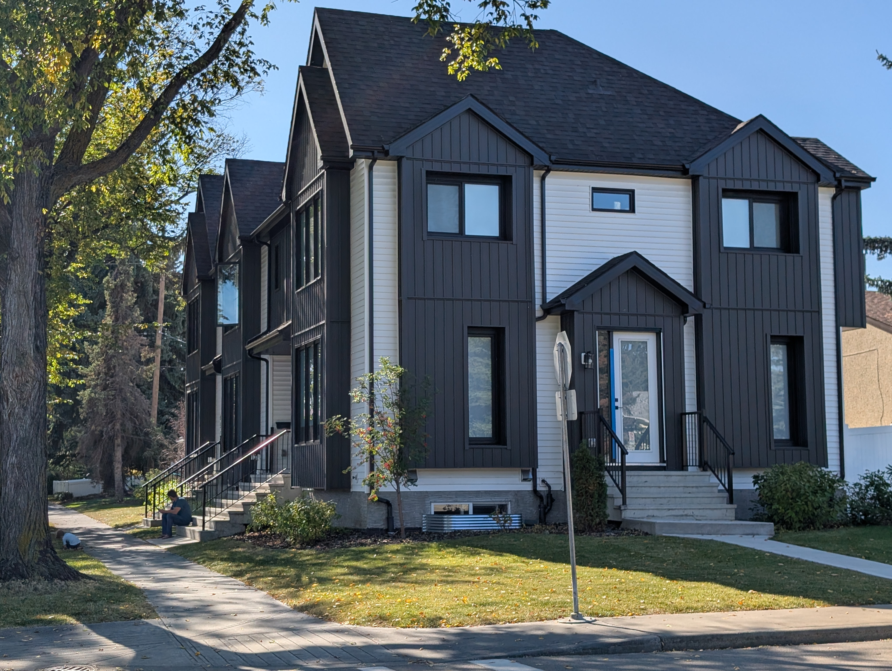

```{r}
#| label: key-facts-setup
#| include: false
library(tidyverse)
library(sf)
library(gt)
library(mountainmathHelpers)
library(tidytransit)
library(jdawangHelpers)
options(
  cancensus.api_key = Sys.getenv("CM_API_KEY"),
  cancensus.cache_path = Sys.getenv("CM_CACHE_PATH"),
  tongfen.cache_path = Sys.getenv("TONGFEN_CACHE_PATH"),
  nextzen_API_key = Sys.getenv("NEXTZEN_API_KEY")
)

bp_raw <- get_edmonton_building_permit_data(
  cache_dir = Sys.getenv("EDMONTON_BP_CACHE_PATH"),
  end_date = "2026-09-30",
  force_refresh = FALSE,
)
crs <- lambert_conformal_conic_at(bp_raw)
bp_raw <- st_transform(bp_raw, crs)

bp <- bp_raw |>
  filter(year < 2026 | (year == 2026 & month_number <= 9)) |>
  filter_edmonton_residential() |>
  filter(units_added >= 1, work_type != "(04) Excavation") |>
  add_edmonton_project_type() |>
  add_edmonton_suite_info() |>
  add_edmonton_neighbourhood_type()

# Jan-Sep data for all years (for YoY comparison and transit)
bp_ytd <- bp |> filter(month_number <= 9)

# Historical Jan-Sep vs full-year ratios (for multiplier)
ytd_ratios <- bp |>
  st_drop_geometry() |>
  filter(year < 2026) |>
  group_by(year) |>
  summarize(
    full_year = sum(units_added),
    ytd = sum(units_added[month_number <= 9]),
    .groups = "drop"
  ) |>
  mutate(ratio = full_year / ytd)

ytd_multiplier <- round(median(ytd_ratios$ratio), 1)

# Jan-Sep 2026 totals
ytd_2026_total <- bp_ytd |>
  st_drop_geometry() |>
  filter(year == 2026) |>
  summarize(total = sum(units_added)) |>
  pull(total)

ytd_2025_total <- bp_ytd |>
  st_drop_geometry() |>
  filter(year == 2025) |>
  summarize(total = sum(units_added)) |>
  pull(total)

yoy_pct <- round((ytd_2026_total / ytd_2025_total - 1) * 100, 1)
annualized_2026 <- round(ytd_2026_total * ytd_multiplier)

# Transit proximity for Jan-Sep 2026
future_stops <- read_sf("../../../data/future_lrt_stops.geojson") |>
  filter(
    !(stop_name %in%
      c(
        "Castle Downs Station",
        "145 Ave Station",
        "137 Ave Station",
        "132 Ave Station"
      ))
  )

transit_stops <- load_edmonton_transit_stops(
  gtfs_path = "../../../data/ca-alberta-edmonton-transit-system-gtfs-714.zip",
  service_date = as.Date("2023-11-09"),
  future_stops = future_stops,
  crs = crs
)

pct_800m_ytd_2026 <- bp_ytd |>
  filter(year == 2026, !st_is_empty(geometry)) |>
  add_transit_distance(transit_stops) |>
  st_drop_geometry() |>
  summarize(
    pct = sum(units_added[distance_from_lrt <= 0.8]) / sum(units_added)
  ) |>
  pull(pct)

pct_800m_2025 <- bp |>
  filter(year == 2025, !st_is_empty(geometry)) |>
  add_transit_distance(transit_stops) |>
  st_drop_geometry() |>
  summarize(
    pct = sum(units_added[distance_from_lrt <= 0.8]) / sum(units_added)
  ) |>
  pull(pct)

# Top project type in Jan-Sep 2026
top_project_type <- bp_ytd |>
  st_drop_geometry() |>
  filter(year == 2026) |>
  group_by(project_type) |>
  summarize(total = sum(units_added), .groups = "drop") |>
  slice_max(total, n = 1) |>
  pull(project_type)

# Homes permitted by neighbourhood type, Q1-Q3 2026 vs Q1-Q3 2025
nbhd_type_yoy <- bp_ytd |>
  st_drop_geometry() |>
  filter(year %in% c(2025, 2026), !is.na(neighbourhood_type)) |>
  group_by(year, neighbourhood_type) |>
  summarize(total = sum(units_added), .groups = "drop") |>
  pivot_wider(names_from = year, values_from = total, names_prefix = "y") |>
  mutate(diff = y2026 - y2025, pct = round((y2026 / y2025 - 1) * 100, 1))

mature_2026 <- nbhd_type_yoy |>
  filter(neighbourhood_type == "Mature") |>
  pull(y2026)
mature_2025 <- nbhd_type_yoy |>
  filter(neighbourhood_type == "Mature") |>
  pull(y2025)
mature_diff <- nbhd_type_yoy |>
  filter(neighbourhood_type == "Mature") |>
  pull(diff)
mature_pct <- nbhd_type_yoy |>
  filter(neighbourhood_type == "Mature") |>
  pull(pct)

henday_2026 <- nbhd_type_yoy |>
  filter(neighbourhood_type == "Outside Henday") |>
  pull(y2026)
henday_2025 <- nbhd_type_yoy |>
  filter(neighbourhood_type == "Outside Henday") |>
  pull(y2025)
henday_diff <- nbhd_type_yoy |>
  filter(neighbourhood_type == "Outside Henday") |>
  pull(diff)
henday_pct <- nbhd_type_yoy |>
  filter(neighbourhood_type == "Outside Henday") |>
  pull(pct)

# Share of the Q1-Q3 decline from 9+ apartments
apt_yoy <- bp_ytd |>
  st_drop_geometry() |>
  filter(year %in% c(2025, 2026), project_type == "9+ Apartment") |>
  group_by(year) |>
  summarize(total = sum(units_added), .groups = "drop")
apt_2025 <- apt_yoy |> filter(year == 2025) |> pull(total)
apt_2026 <- apt_yoy |> filter(year == 2026) |> pull(total)
apt_share_of_drop <- (apt_2025 - apt_2026) / (ytd_2025_total - ytd_2026_total)

# RS Zone 5-8 unit homes, Q1-Q3 2025 vs Q1-Q3 2026
rs_plex_yoy <- bp_ytd |>
  st_drop_geometry() |>
  filter(
    year %in% c(2025, 2026),
    zoning == "RS",
    between(units_added, 5, 8)
  ) |>
  group_by(year) |>
  summarize(total = sum(units_added), .groups = "drop")
rs_plex_2025 <- rs_plex_yoy |> filter(year == 2025) |> pull(total)
rs_plex_2026 <- rs_plex_yoy |> filter(year == 2026) |> pull(total)
rs_plex_pct <- rs_plex_2026 / rs_plex_2025 - 1

# RS-zoned properties from the assessment data (also used in later tables)
assessment_rs <- read_sf(
  "../../../data/Property Information (Current Calendar Year)_20260113/"
) |>
  st_drop_geometry() |>
  rename(
    house_number = house_numb,
    street_name = street_nam,
    neighbourhood = neighbou_2
  ) |>
  filter(zoning == "RS", !is.na(house_number)) |>
  distinct(house_number, street_name, .keep_all = TRUE)

nbhd_type_lookup <- bp |>
  st_drop_geometry() |>
  distinct(neighbourhood, neighbourhood_type) |>
  filter(!is.na(neighbourhood_type))

assessment_rs <- assessment_rs |>
  left_join(nbhd_type_lookup, by = "neighbourhood")

# Homes permitted since the RS Zone took effect
since_zbr_by_type <- bp |>
  st_drop_geometry() |>
  filter(year >= 2024, !is.na(neighbourhood_type)) |>
  group_by(neighbourhood_type) |>
  summarize(total = sum(units_added), .groups = "drop")
total_homes_since_zbr <- sum(since_zbr_by_type$total)
mature_share_since_zbr <- since_zbr_by_type |>
  filter(neighbourhood_type == "Mature") |>
  pull(total) /
  total_homes_since_zbr

mature_plex_since_zbr <- bp |>
  st_drop_geometry() |>
  filter(
    year >= 2024,
    zoning == "RS",
    between(units_added, 5, 8),
    neighbourhood_type == "Mature"
  ) |>
  summarize(n_permits = n(), total_units = sum(units_added))
mature_rs_properties <- assessment_rs |>
  filter(neighbourhood_type == "Mature") |>
  nrow()
mature_plex_pct_redeveloped <- mature_plex_since_zbr$n_permits /
  mature_rs_properties
mature_plex_share_of_homes <- mature_plex_since_zbr$total_units /
  total_homes_since_zbr

# Frequent transit (LRT within 800m or frequent bus within 400m)
frequent_bus_stops <- get_edmonton_frequent_bus_stops(
  gtfs_path = "../../../data/ca-alberta-edmonton-transit-system-gtfs-714.zip",
  service_date = as.Date("2023-11-09"),
  crs = crs
)

pct_frequent_transit_ytd_2026 <- bp_ytd |>
  filter(year == 2026, !st_is_empty(geometry)) |>
  add_frequent_transit_distance(transit_stops, frequent_bus_stops) |>
  st_drop_geometry() |>
  summarize(
    pct = sum(
      units_added[distance_from_lrt <= 0.8 | distance_from_frequent_bus <= 0.4]
    ) /
      sum(units_added)
  ) |>
  pull(pct)

# Lower unit cap scenarios
rs_cap_universe <- bp |>
  st_drop_geometry() |>
  filter(zoning == "RS", between(units_added, 1, 8))

cap_scenario <- function(data, denom) {
  map(1:7, function(c) {
    over <- filter(data, units_added > c)
    tibble(
      cap = c,
      lost_low = sum(over$units_added - c),
      lost_high = sum(over$units_added),
      pct_low = sum(over$units_added - c) / denom,
      pct_high = sum(over$units_added) / denom
    )
  }) |>
    list_rbind()
}

cap_scenario_ytd <- cap_scenario(
  filter(rs_cap_universe, year == 2026),
  ytd_2026_total
)

cap4_pct_low_ytd <- cap_scenario_ytd |> filter(cap == 4) |> pull(pct_low)
cap4_pct_high_ytd <- cap_scenario_ytd |> filter(cap == 4) |> pull(pct_high)
cap2_pct_high_ytd <- cap_scenario_ytd |> filter(cap == 2) |> pull(pct_high)

# Fiveplex to eightplex permit counts (all zones), Q1-Q3 2025 vs Q1-Q3 2026
plex_permits_yoy <- bp_ytd |>
  st_drop_geometry() |>
  filter(year %in% c(2025, 2026), project_type == "Fiveplex to Eightplex") |>
  count(year)
plex_permits_2025 <- plex_permits_yoy |> filter(year == 2025) |> pull(n)
plex_permits_2026 <- plex_permits_yoy |> filter(year == 2026) |> pull(n)

# Projected 2026 homes by neighbourhood type and project type
projected_2026_by_nbhd_type <- bp_ytd |>
  st_drop_geometry() |>
  filter(year == 2026, !is.na(neighbourhood_type)) |>
  group_by(neighbourhood_type, project_type) |>
  summarize(total = sum(units_added) * ytd_multiplier, .groups = "drop")
mature_plex_projected <- projected_2026_by_nbhd_type |>
  filter(
    neighbourhood_type == "Mature",
    project_type == "Fiveplex to Eightplex"
  ) |>
  pull(total)
henday_sd_projected <- projected_2026_by_nbhd_type |>
  filter(
    neighbourhood_type == "Outside Henday",
    project_type == "Single detached"
  ) |>
  pull(total)

# Monthly pace of homes permitted in mature neighbourhoods, before vs since
# the RS Zone (180 months in 2009-2023, 33 months in Jan 2024 - Sep 2026)
mature_pace <- bp |>
  st_drop_geometry() |>
  filter(neighbourhood_type == "Mature") |>
  mutate(since_zbr = year >= 2024) |>
  group_by(since_zbr) |>
  summarize(total = sum(units_added), .groups = "drop") |>
  mutate(
    months = if_else(since_zbr, 2 * 12 + 9, (2023 - 2009 + 1) * 12),
    per_month = total / months
  )
mature_pace_pre <- mature_pace |> filter(!since_zbr) |> pull(per_month)
mature_pace_post <- mature_pace |> filter(since_zbr) |> pull(per_month)
mature_pace_ratio <- mature_pace_post / mature_pace_pre

# Share of RS-zoned properties redeveloped into more than a single detached
# home since Jan 2024 (same definition as fig-cumulative-rs-project-type)
rs_pct_redeveloped_since_zbr <- bp |>
  st_drop_geometry() |>
  filter(
    year >= 2024,
    zoning == "RS",
    !is.na(project_type),
    project_type != "Single detached"
  ) |>
  nrow() /
  nrow(assessment_rs)

# Crestwood 5-8 unit RS redevelopment, Q1-Q3 2026
crestwood_pct_redeveloped <- bp_ytd |>
  st_drop_geometry() |>
  filter(
    year == 2026,
    zoning == "RS",
    between(units_added, 5, 8),
    neighbourhood == "CRESTWOOD"
  ) |>
  nrow() /
  sum(assessment_rs$neighbourhood == "CRESTWOOD")

# RS Zone 1-8 unit permits by exact unit count (also used in tbl-unit-breakdown)
unit_breakdown <- bp_ytd |>
  st_drop_geometry() |>
  filter(year %in% c(2025, 2026), zoning == "RS", between(units_added, 1, 8)) |>
  group_by(year, units_added) |>
  summarize(
    n_permits = n(),
    total_units = sum(units_added),
    .groups = "drop"
  ) |>
  pivot_wider(
    names_from = year,
    values_from = c(n_permits, total_units),
    values_fill = 0
  ) |>
  select(
    units_added,
    n_permits_2025,
    total_units_2025,
    n_permits_2026,
    total_units_2026
  ) |>
  arrange(units_added)
units_8 <- unit_breakdown |> filter(units_added == 8)
units_7 <- unit_breakdown |> filter(units_added == 7)
units_6 <- unit_breakdown |> filter(units_added == 6)
rs_1to8_2025 <- sum(unit_breakdown$total_units_2025)
rs_1to8_2026 <- sum(unit_breakdown$total_units_2026)
```

Edmonton permitted `r scales::percent(abs(yoy_pct) / 100, accuracy = 1)` `r if (yoy_pct >= 0) "more" else "fewer"` homes in the first nine months of 2026 than in the same period of record-setting 2025. Most of that drop is large apartments. Meanwhile, rowhomes in the RS Zone kept growing, and fiveplex to eightplex homes are now the largest category of homes permitted in the city. It's the same story as at [mid-year](../q2-building-permits/index.qmd): fewer homes overall, but more small-scale infill than ever.

That matters right now. This post comes out as Danielle Smith has indicated interest in Edmonton's zoning bylaw after lobbying from a lobbying organization led by people associated with failed municipal council candidates. Let's be clear: Edmonton's housing supply now relies on small-scale infill as a key piece. A four-unit cap on the RS Zone would have cost between `r scales::percent(cap4_pct_low_ytd, accuracy = 1)` and `r scales::percent(cap4_pct_high_ytd, accuracy = 1)` of all homes permitted in Edmonton this year. Any restriction on small-scale infill would significantly reduce the number of homes built, and therefore increase rents and home prices.

With this post, I am also announcing the launch of a new [infill dashboard](/projects/infill-dashboard/). It maps every new backyard house, duplex to fourplex and fiveplex to eightplex permit in RS-zoned neighbourhoods since January 2024, with a [table view](/projects/infill-dashboard/#view=table) of every neighbourhood that you can search, sort and download. I will refresh it every quarter alongside this report.

New this quarter, I zoomed out to the cumulative number of homes permitted since 2009, compared RS Zone redevelopment against the full stock of RS-zoned properties, and estimated how many homes a lower unit cap in the RS Zone would cost.

{#fig-rowhouse-image fig-alt="A rowhouse in Hazeldean" width="538"}

## Key facts

- Edmonton permitted **`r scales::comma(ytd_2026_total)`** homes in Q1–Q3 2026, **`r scales::percent(abs(yoy_pct) / 100, accuracy = 1)` `r if (yoy_pct >= 0) "more" else "fewer"`** than the `r scales::comma(ytd_2025_total)` in Q1–Q3 2025. Most of the drop is large apartments, which fell from `r scales::comma(apt_2025)` to `r scales::comma(apt_2026)` homes after a record in 2025. Annualized, 2026 is on track for roughly **`r scales::comma(annualized_2026)`** homes, similar to 2014 and 2022.

- A lower unit cap would be costly. A four-unit cap would have cost between **`r scales::percent(cap4_pct_low_ytd, accuracy = 1)`** and **`r scales::percent(cap4_pct_high_ytd, accuracy = 1)`** of homes permitted in Q1–Q3 2026, and a two-unit cap up to **`r scales::percent(cap2_pct_high_ytd, accuracy = 1)`**. See [What a lower cap would cost](#what-a-lower-cap-would-cost) for more details.

- **Fiveplex to eightplex** rowhomes edged past last year's record and are now the largest category of homes permitted in Edmonton. In the RS Zone, they added **`r scales::comma(rs_plex_2026)`** homes in Q1–Q3 2026, up `r scales::percent(rs_plex_pct, accuracy = 1)` from `r scales::comma(rs_plex_2025)`, even as the city overall slowed. That's `r scales::percent(rs_plex_2026 / ytd_2026_total, accuracy = 1)` of all homes permitted this year.

- Homes permitted in mature neighbourhoods were **`r scales::percent(abs(mature_pct) / 100, accuracy = 1)` `r if (mature_diff >= 0) "higher" else "lower"`** than Q1–Q3 2025 (`r scales::comma(mature_2025)` → `r scales::comma(mature_2026)`), entirely because of a decrease in large apartments. Fiveplex to eightplex homes in mature neighbourhoods hit a new high.

- Since the RS Zone took effect in January 2024, Edmonton has permitted **`r scales::comma(total_homes_since_zbr)`** homes, `r scales::percent(mature_share_since_zbr, accuracy = 1)` of them in mature neighbourhoods. Fiveplex to eightplex infill in mature neighbourhoods has added **`r scales::comma(mature_plex_since_zbr$total_units)`** of those homes (**`r scales::percent(mature_plex_share_of_homes, accuracy = 1)`**) across `r scales::comma(mature_plex_since_zbr$n_permits)` permits, while redeveloping just **`r scales::percent(mature_plex_pct_redeveloped, accuracy = 0.01)`** of RS-zoned properties there.

- **`r scales::percent(pct_800m_ytd_2026, accuracy = 1)`** of homes were permitted within 800m of an existing or under-construction LRT stop in Q1–Q3 2026, compared to `r scales::percent(pct_800m_2025, accuracy = 1)` in 2025 (full year), a dip that mostly reflects the apartment slowdown. Counting frequent bus stops within 400m, it's **`r scales::percent(pct_frequent_transit_ytd_2026, accuracy = 1)`**.

::: {.callout-note collapse="true" title="Data and methods"}
```{r}
#| label: data-load
# bp, bp_ytd, transit_stops, frequent_bus_stops and assessment_rs are
# already loaded in key-facts-setup chunk above

# Population data
population_1971 <- read_csv(
  "../../../data/population_1971.csv",
  show_col_types = FALSE
) |>
  select(neighbourhood = Neighbourhood, n_1971 = `Total - Age`)

population_2021 <- read_csv(
  "../../../data/population_2021.csv",
  show_col_types = FALSE
) |>
  distinct() |>
  rename(neighbourhood = NEIGHBOURHOOD, n_2021 = `2021`)

population_change <- population_2021 |>
  full_join(population_1971, by = "neighbourhood") |>
  replace_na(list(n_2021 = 0, n_1971 = 0)) |>
  mutate(pct_change = n_2021 / n_1971 - 1)
```

Edmonton's [general building permit data](https://data.edmonton.ca/Urban-Planning-Economy/General-Building-Permits/24uj-dj8v/about_data) tracks building permits since 2009, with columns for building type, work type, location, units added, and more. Like the [mid-year post](../q2-building-permits/index.qmd), this post fetches permit data directly from Edmonton's Open Data API, filtered to Jan–Sep to exclude incomplete Q4 data.

Edmonton's [property assessment data](https://data.edmonton.ca/City-Administration/Property-Assessment-Data-Current-Calendar-Year-/q7d6-ambg/about_data) provides one row per property with zoning and neighbourhood information, used to calculate how many RS-zoned properties exist per neighbourhood.

For background on the RS Zone and ZBR, see the [two-year review post](../zbr-two-year-review/index.qmd).

Similar to my [Q1](../q1-building-permits/index.qmd) and [mid-year](../q2-building-permits/index.qmd) posts, to annualize the 2026 Jan–Sep numbers to the full year, I estimate an annualization multiplier from historical data. For each year from 2009 to 2025, I calculate the ratio of full-year units to Jan–Sep units, and use the median as the multiplier.

```{r}
#| label: fig-ytd-multiplier
#| fig-cap: "Historical ratio of full-year to Jan–Sep residential building permit units"
ggplot(ytd_ratios, aes(x = year, y = ratio)) +
  geom_line(linewidth = 1) +
  geom_point() +
  geom_hline(
    yintercept = ytd_multiplier,
    linetype = "dashed",
    colour = "grey60"
  ) +
  annotate(
    "text",
    x = 2015,
    y = ytd_multiplier + 0.3,
    label = paste0("Median: ", ytd_multiplier),
    size = 3.5
  ) +
  labs(
    title = "Ratio of full-year to Jan-Sep residential building permit units",
    subtitle = "2009-2025",
    x = "Year",
    y = "Full-year / Jan-Sep ratio",
    caption = CAPTION_COE
  ) +
  theme_jd(mode = "light")
```

The median Jan–Sep multiplier is `r ytd_multiplier`×, as shown in @fig-ytd-multiplier, meaning a full year typically produces `r ytd_multiplier` times the homes permitted in Jan–Sep alone. All 2026 projections in this post use this multiplier.
:::

## Year-over-year Q1–Q3 comparison

The most direct way to compare 2026 to prior years is to look at the same nine months across all years, stripping out seasonality entirely. @fig-ytd-yoy-units shows units added in Q1–Q3 for each year since 2009, broken down by project type. Homes permitted are down `r abs(yoy_pct)`% from last year, and once again, it's mostly about apartments. The 9+ Apartment category fell from its 2025 record of `r scales::comma(apt_2025)` homes to `r scales::comma(apt_2026)`, which accounts for `r scales::percent(apt_share_of_drop, accuracy = 1)` of the overall drop. Apartment permits are lumpy: a handful of large projects can swing the total by thousands. Single detached and duplex to fourplex homes are also down. The one major category that's up is the fiveplex to eightplex rowhome, which edged past last year's record and overtook single detached homes.

```{r}
#| label: fig-ytd-yoy-units
#| fig-cap: "Total homes permitted in Q1–Q3 by project type, 2009–2026"
#| fig-subcap: ["Line plot", "Area plot"]
ytd_by_type <- bp_ytd |>
  st_drop_geometry() |>
  group_by(year, project_type, .drop = FALSE) |>
  summarize(total = sum(units_added), num_projects = n(), .groups = "drop")

ggplot(ytd_by_type, aes(x = year, y = total, colour = project_type)) +
  geom_line(linewidth = 1) +
  geom_point() +
  scale_y_continuous(labels = scales::label_comma()) +
  labs(
    title = "Homes permitted by project type",
    subtitle = "Q1–Q3 building permits, 2009–2026",
    colour = "Project type",
    x = "Year",
    y = "Homes permitted",
    caption = CAPTION_COE
  ) +
  theme_jd(mode = "light")

ggplot(ytd_by_type, aes(x = year, y = total, fill = project_type)) +
  geom_area() +
  scale_y_continuous(labels = scales::label_comma()) +
  labs(
    title = "Homes permitted by project type",
    subtitle = "Q1–Q3 building permits, 2009–2026",
    fill = "Project type",
    x = "Year",
    y = "Homes permitted",
    caption = CAPTION_COE
  ) +
  theme_jd(mode = "light")
```

@fig-ytd-yoy-permits shows the same Q1–Q3 data as raw permit counts rather than units, showing how many separate projects are behind each category. Single detached homes still dominate the permit count, since each permit is just one home. Fiveplex to eightplex permits came in at `r scales::comma(plex_permits_2026)`, compared to last year's record of `r scales::comma(plex_permits_2025)`, while duplex to fourplex permits fell back towards pre-2024 levels.

```{r}
#| label: fig-ytd-yoy-permits
#| fig-cap: "Number of building permits issued in Q1–Q3 by project type, 2009–2026"
#| fig-subcap: ["Line plot", "Area plot"]
ggplot(ytd_by_type, aes(x = year, y = num_projects, colour = project_type)) +
  geom_line(linewidth = 1) +
  geom_point() +
  scale_y_continuous(labels = scales::label_comma()) +
  labs(
    title = "Building permits issued by project type",
    subtitle = "Q1–Q3 building permits, 2009–2026",
    colour = "Project type",
    x = "Year",
    y = "Number of permits",
    caption = CAPTION_COE
  ) +
  theme_jd(mode = "light")

ggplot(ytd_by_type, aes(x = year, y = num_projects, fill = project_type)) +
  geom_area() +
  scale_y_continuous(labels = scales::label_comma()) +
  labs(
    title = "Building permits issued by project type",
    subtitle = "Q1–Q3 building permits, 2009–2026",
    fill = "Project type",
    x = "Year",
    y = "Number of permits",
    caption = CAPTION_COE
  ) +
  theme_jd(mode = "light")
```

Looking at the number of homes by neighbourhood type, @fig-ytd-yoy-nbhd shows that homes permitted in mature neighbourhoods are down `r abs(mature_pct)`% from last year. But the apartment category alone fell by more than that total: fiveplex to eightplex homes in mature neighbourhoods are up again, to another record. Between the mature core and the Henday, apartments fell off a cliff after a big 2025. Outside the Henday, the `r abs(henday_pct)`% decline is spread across single detached and duplex to fourplex homes.

```{r}
#| label: fig-ytd-yoy-nbhd
#| fig-cap: "Total homes permitted in Q1–Q3 by neighbourhood type, 2009–2026"
#| fig-subcap: ["Line plot", "Area plot"]
ytd_by_nbhd_type <- bp_ytd |>
  st_drop_geometry() |>
  filter(!is.na(neighbourhood_type)) |>
  group_by(year, neighbourhood_type, project_type, .drop = FALSE) |>
  summarize(total = sum(units_added), .groups = "drop")

ggplot(ytd_by_nbhd_type, aes(x = year, y = total, colour = project_type)) +
  geom_line(linewidth = 1) +
  geom_point() +
  scale_y_continuous(labels = scales::label_comma()) +
  facet_wrap(vars(neighbourhood_type)) +
  labs(
    title = "Homes permitted by neighbourhood type and project type",
    subtitle = "Q1–Q3 building permits, 2009–2026",
    colour = "Project type",
    x = "Year",
    y = "Homes permitted",
    caption = CAPTION_COE
  ) +
  theme_jd(mode = "light")

ggplot(ytd_by_nbhd_type, aes(x = year, y = total, fill = project_type)) +
  geom_area() +
  scale_y_continuous(labels = scales::label_comma()) +
  facet_wrap(vars(neighbourhood_type)) +
  labs(
    title = "Homes permitted by neighbourhood type and project type",
    subtitle = "Q1–Q3 building permits, 2009–2026",
    fill = "Project type",
    x = "Year",
    y = "Homes permitted",
    caption = CAPTION_COE
  ) +
  theme_jd(mode = "light")
```

## Projecting 2026 from Q1–Q3 data

With three quarters of the year under our belt, the projection for the full year is on firmer ground than it was at mid-year. @fig-annualized-units shows the full-year units added by project type, with 2026 projected from Q1–Q3 using the `r ytd_multiplier`× adjustment.

The total projection of roughly `r scales::comma(annualized_2026)` homes is down from the 13,726 I projected at [mid-year](../q2-building-permits/index.qmd). It lands well below 2025's record and 2024, roughly in line with 2014 and 2022. That's still a solid year by Edmonton's historical standards, just not another record. Within that total, fiveplex to eightplex homes are projected to edge out 2025's record and, for the first time, finish a full year as the single largest category of homes permitted in the city.

```{r}
#| label: fig-annualized-units
#| fig-cap: "Total homes permitted by project type, 2009–2025 (full year) and 2026 (projected from Jan–Sep)"
#| fig-subcap: ["Line plot", "Area plot"]
annual_by_type <- bp |>
  st_drop_geometry() |>
  filter(year < 2026) |>
  group_by(year, project_type, .drop = FALSE) |>
  summarize(total = sum(units_added), num_projects = n(), .groups = "drop")

projected_2026 <- bp_ytd |>
  st_drop_geometry() |>
  filter(year == 2026) |>
  group_by(year, project_type, .drop = FALSE) |>
  summarize(
    total = sum(units_added) * ytd_multiplier,
    num_projects = n() * ytd_multiplier,
    .groups = "drop"
  ) |>
  mutate(projected = TRUE)

plot_data <- bind_rows(
  mutate(annual_by_type, projected = FALSE),
  projected_2026
)

ggplot(plot_data, aes(x = year, y = total, colour = project_type)) +
  geom_line(linewidth = 1) +
  geom_point() +
  scale_y_continuous(labels = scales::label_comma()) +
  labs(
    title = "Homes permitted by project type",
    subtitle = paste0(
      "Full year 2009–2025; 2026 projected from Jan–Sep (×",
      ytd_multiplier,
      ")"
    ),
    colour = "Project type",
    x = "Year",
    y = "Homes permitted",
    caption = CAPTION_COE
  ) +
  theme_jd(mode = "light")

ggplot(plot_data, aes(x = year, y = total, fill = project_type)) +
  geom_area() +
  scale_y_continuous(labels = scales::label_comma()) +
  labs(
    title = "Homes permitted by project type",
    subtitle = paste0(
      "Full year 2009–2025; 2026 projected from Jan–Sep (×",
      ytd_multiplier,
      ")"
    ),
    fill = "Project type",
    x = "Year",
    y = "Homes permitted",
    caption = CAPTION_COE
  ) +
  theme_jd(mode = "light")
```

@fig-annualized-nbhd breaks the same projection down by neighbourhood type. The fiveplex to eightplex category in mature neighbourhoods is projected to contribute about `r scales::comma(mature_plex_projected, accuracy = 100)` homes this year, making it the single largest source of new homes of any project type in any part of the city, ahead of even the `r scales::comma(henday_sd_projected, accuracy = 100)` single detached homes projected outside the Henday. I have seen firsthand on social media videos and ads from landlords of new rowhomes lowering rents and offering incentives to find tenants, but nine months in, it seems like we have not yet hit the rent floor where building permits slow down. We are still playing catch-up on years of suppressed demand to live centrally.

The slowdown shows up mostly outside the mature core. Between the mature core and the Henday, the drop in apartments leaves the projection at a fraction of recent years. Outside the Henday, supply is down from last year but on track to remain relatively strong.

```{r}
#| label: fig-annualized-nbhd
#| fig-cap: "Homes permitted by neighbourhood type, 2009–2025 (full year) and 2026 (projected from Jan–Sep)"
#| fig-subcap: ["Line plot", "Area plot"]
#| classes: preview-image
annual_nbhd <- bp |>
  st_drop_geometry() |>
  filter(year < 2026, !is.na(neighbourhood_type)) |>
  group_by(year, neighbourhood_type, project_type, .drop = FALSE) |>
  summarize(total = sum(units_added), .groups = "drop") |>
  mutate(projected = FALSE)

projected_2026_nbhd <- bp_ytd |>
  st_drop_geometry() |>
  filter(year == 2026, !is.na(neighbourhood_type)) |>
  group_by(year, neighbourhood_type, project_type, .drop = FALSE) |>
  summarize(total = sum(units_added) * ytd_multiplier, .groups = "drop") |>
  mutate(projected = TRUE)

plot_nbhd <- bind_rows(annual_nbhd, projected_2026_nbhd)

ggplot(plot_nbhd, aes(x = year, y = total, colour = project_type)) +
  geom_line(linewidth = 1) +
  geom_point() +
  scale_y_continuous(labels = scales::label_comma()) +
  facet_wrap(vars(neighbourhood_type)) +
  labs(
    title = "Homes permitted by neighbourhood type and project type",
    subtitle = paste0(
      "Full year 2009–2025; 2026 projected from Jan–Sep (×",
      ytd_multiplier,
      ")"
    ),
    colour = "Project type",
    x = "Year",
    y = "Homes permitted",
    caption = CAPTION_COE
  ) +
  theme_jd(mode = "light")

ggplot(plot_nbhd, aes(x = year, y = total, fill = project_type)) +
  geom_area() +
  scale_y_continuous(labels = scales::label_comma()) +
  facet_wrap(vars(neighbourhood_type)) +
  labs(
    title = "Homes permitted by neighbourhood type and project type",
    subtitle = paste0(
      "Full year 2009–2025; 2026 projected from Jan–Sep (×",
      ytd_multiplier,
      ")"
    ),
    fill = "Project type",
    x = "Year",
    y = "Homes permitted",
    caption = CAPTION_COE
  ) +
  theme_jd(mode = "light")
```

## Cumulative homes since the RS Zone took effect

What has the RS Zone changed over the long run? @fig-cumulative-since-2009 zooms all the way out, tracking the running total of homes permitted by neighbourhood type since 2009, with the date the RS Zone took effect marked.

```{r}
#| label: fig-cumulative-since-2009
#| fig-cap: "Cumulative homes permitted by neighbourhood type since 2009"
zbr_effective_date <- make_date(2024, 1, 1)

cumulative_since_2009 <- bp |>
  st_drop_geometry() |>
  filter(!is.na(neighbourhood_type)) |>
  mutate(month = make_date(year, month_number, 1)) |>
  group_by(neighbourhood_type, month) |>
  summarize(units = sum(units_added), .groups = "drop") |>
  complete(
    neighbourhood_type,
    month = seq(make_date(2009, 1, 1), make_date(2026, 9, 1), by = "month"),
    fill = list(units = 0)
  ) |>
  arrange(month) |>
  group_by(neighbourhood_type) |>
  mutate(cumulative = cumsum(units)) |>
  ungroup()

total_homes_since_2009 <- cumulative_since_2009 |>
  filter(month == max(month)) |>
  summarize(total = sum(cumulative)) |>
  pull(total)

ggplot(
  cumulative_since_2009,
  aes(x = month, y = cumulative, colour = neighbourhood_type)
) +
  geom_line(linewidth = 1) +
  geom_vline(
    xintercept = zbr_effective_date,
    linetype = "dotted",
    colour = "grey40"
  ) +
  annotate(
    "text",
    x = zbr_effective_date,
    y = Inf,
    label = "RS Zone (ZBR) takes effect",
    angle = 90,
    vjust = 1.2,
    hjust = 1.1,
    size = 3,
    colour = "grey40"
  ) +
  scale_x_date(date_labels = "%Y", date_breaks = "2 years") +
  scale_y_continuous(labels = scales::label_comma()) +
  labs(
    title = "Cumulative homes permitted since 2009",
    subtitle = "By neighbourhood type",
    colour = "Neighbourhood type",
    x = NULL,
    y = "Cumulative homes permitted",
    caption = CAPTION_COE
  ) +
  theme_jd(mode = "light")
```

For 15 years, the mature neighbourhood line climbed at a steady, modest pace. After January 2024, it bends sharply upward. Since January 2024, mature neighbourhoods have permitted an average of `r scales::comma(mature_pace_post)` homes a month, `r round(mature_pace_ratio, 1)` times their 2009–2023 average of `r scales::comma(mature_pace_pre)`. @fig-cumulative-nbhd zooms in on the period since January 2024, tracking the running total of homes permitted each month, split by neighbourhood type.

```{r}
#| label: fig-cumulative-nbhd
#| fig-cap: "Cumulative homes permitted by neighbourhood type since the RS Zone took effect (Jan 2024)"
cumulative_since_zbr <- bp |>
  st_drop_geometry() |>
  filter(year >= 2024, !is.na(neighbourhood_type)) |>
  mutate(month = make_date(year, month_number, 1)) |>
  group_by(neighbourhood_type, month) |>
  summarize(units = sum(units_added), .groups = "drop") |>
  complete(
    neighbourhood_type,
    month = seq(make_date(2024, 1, 1), make_date(2026, 9, 1), by = "month"),
    fill = list(units = 0)
  ) |>
  arrange(month) |>
  group_by(neighbourhood_type) |>
  mutate(cumulative = cumsum(units)) |>
  ungroup()

# First month after which mature neighbourhoods stay ahead of the areas
# between the mature core and the Henday
mature_overtake_month <- cumulative_since_zbr |>
  select(neighbourhood_type, month, cumulative) |>
  pivot_wider(names_from = neighbourhood_type, values_from = cumulative) |>
  filter(Mature <= `Between mature and Henday`) |>
  summarize(month = max(month) %m+% months(1)) |>
  pull(month)

ggplot(
  cumulative_since_zbr,
  aes(x = month, y = cumulative, colour = neighbourhood_type)
) +
  geom_line(linewidth = 1) +
  scale_x_date(date_labels = "%b %Y", date_breaks = "6 months") +
  scale_y_continuous(labels = scales::label_comma()) +
  labs(
    title = "Cumulative homes permitted since the RS Zone took effect",
    subtitle = "By neighbourhood type, Jan 2024 – Sep 2026",
    colour = "Neighbourhood type",
    x = NULL,
    y = "Cumulative homes permitted",
    caption = CAPTION_COE
  ) +
  theme_jd(mode = "light")
```

Outside the Henday still adds the most homes in raw terms. But mature neighbourhoods durably overtook the areas between the mature core and the Henday back in `r format(mature_overtake_month, "%B %Y")`, and the gap has only widened since. Since January 2024, Edmonton has permitted `r scales::comma(total_homes_since_zbr)` homes, and `r scales::percent(mature_share_since_zbr, accuracy=1)` of them landed in mature neighbourhoods.

## Top neighbourhoods for RS infill

Where is the infill actually happening? And how does the level of activity compare to the total number of properties in each neighbourhood?

@tbl-rs-nbhd-type shows the Q1–Q3 2026 5–8 unit RS Zone permit activity by neighbourhood type, compared to the total number of RS-zoned properties. In mature neighbourhoods, about a third of one percent of RS properties got a 5–8 unit permit in the first nine months of the year. Between the mature core and the Henday, it's a rounding error. Once again: incremental growth.

```{r}
#| label: tbl-rs-nbhd-type
#| tbl-cap: "RS Zone 5–8 unit permits vs total properties by neighbourhood type, Q1–Q3 2026"
n_plexes_ytd_2026 <- bp_ytd |>
  st_drop_geometry() |>
  filter(
    year == 2026,
    zoning == "RS",
    between(units_added, 5, 8)
  ) |>
  group_by(neighbourhood_type) |>
  summarize(
    n_permits = n(),
    total_units = sum(units_added),
    .groups = "drop"
  ) |>
  mutate(
    n_permits_projected = n_permits * ytd_multiplier,
    total_units_projected = total_units * ytd_multiplier
  )

n_assessed_rs_by_type <- assessment_rs |>
  filter(!is.na(neighbourhood_type)) |>
  group_by(neighbourhood_type) |>
  summarize(n_properties = n(), .groups = "drop")


n_assessed_rs_by_type |>
  left_join(n_plexes_ytd_2026, by = "neighbourhood_type") |>
  replace_na(list(
    n_permits = 0,
    total_units = 0,
    n_permits_projected = 0,
    total_units_projected = 0
  )) |>
  mutate(
    pct = n_permits / n_properties,
    pct_projected = n_permits_projected / n_properties
  ) |>
  gt() |>
  cols_move(n_properties, after = n_permits) |>
  cols_move(pct, after = n_properties) |>
  cols_move(pct_projected, after = n_permits_projected) |>
  cols_align("left", columns = neighbourhood_type) |>
  fmt_percent(columns = c(pct, pct_projected), decimals = 2) |>
  fmt_integer(
    columns = c(
      n_permits,
      n_properties,
      total_units,
      n_permits_projected,
      total_units_projected,
    )
  ) |>
  cols_label(
    neighbourhood_type = "Neighbourhood type",
    n_properties = "RS-zoned properties",
    n_permits = "Permits",
    total_units = "Homes added",
    pct = "% redeveloped",
    n_permits_projected = "Permits",
    total_units_projected = "Homes added",
    pct_projected = "% redeveloped",
  ) |>
  tab_spanner(label = "Q1–Q3 2026", columns = c(n_permits, total_units, pct)) |>
  tab_spanner(
    label = paste0("Projected 2026 (Jan–Sep ×", ytd_multiplier, ")"),
    columns = c(n_permits_projected, total_units_projected, pct_projected)
  ) |>
  tab_header(
    title = "RS Zone intensity by neighbourhood type",
    subtitle = "Q1–Q3 2026, and projected 2026"
  ) |>
  finalize_gt() |>
  opt_stylize_jd()
```

@tbl-rs-nbhd-type-cumulative adds up every 5–8 unit RS permit since the RS Zone took effect. Nearly three years in, fiveplex to eightplex projects have added `r scales::comma(mature_plex_since_zbr$total_units)` homes in mature neighbourhoods while redeveloping just `r scales::percent(mature_plex_pct_redeveloped, accuracy = 0.01)` of the RS-zoned properties there.

```{r}
#| label: tbl-rs-nbhd-type-cumulative
#| tbl-cap: "Cumulative RS Zone 5–8 unit permits vs total properties by neighbourhood type, Jan 2024 – Q3 2026"
n_plexes_cumulative <- bp |>
  st_drop_geometry() |>
  filter(
    year >= 2024,
    zoning == "RS",
    between(units_added, 5, 8)
  ) |>
  group_by(neighbourhood_type) |>
  summarize(
    n_permits = n(),
    total_units = sum(units_added),
    .groups = "drop"
  )

n_assessed_rs_by_type |>
  left_join(n_plexes_cumulative, by = "neighbourhood_type") |>
  replace_na(list(n_permits = 0, total_units = 0)) |>
  mutate(pct = n_permits / n_properties) |>
  gt() |>
  cols_move(n_properties, after = n_permits) |>
  cols_move(pct, after = n_properties) |>
  cols_align("left", columns = neighbourhood_type) |>
  fmt_percent(columns = pct, decimals = 2) |>
  fmt_integer(columns = c(n_permits, n_properties, total_units)) |>
  cols_label(
    neighbourhood_type = "Neighbourhood type",
    n_permits = "Permits",
    n_properties = "RS-zoned properties",
    pct = "% redeveloped",
    total_units = "Homes added"
  ) |>
  tab_header(
    title = "Cumulative RS Zone intensity by neighbourhood type",
    subtitle = "2024 + 2025 + Q1–Q3 2026 building permits"
  ) |>
  finalize_gt() |>
  opt_stylize_jd()
```

@fig-cumulative-rs-project-type widens the lens to every RS Zone project that adds homes, including backyard houses and duplex to fourplex projects, against the full stock of RS-zoned properties citywide. Even counting all of them, only `r scales::percent(rs_pct_redeveloped_since_zbr, accuracy = 0.1)` of RS properties have been redeveloped into more than a single detached home since January 2024. The bars are almost entirely "Not redeveloped." Neighbourhoods are changing block by block, not overnight.

```{r}
#| label: fig-cumulative-rs-project-type
#| fig-cap: "Cumulative RS Zone redevelopment by project type against the full RS-zoned property stock, 2024 – Q3 2026 (single detached rebuilds counted as not redeveloped)"
total_rs_properties <- nrow(assessment_rs)

# Single detached rebuilds add no density, so they're folded into
# "Not redeveloped" rather than shown as their own slice
cumulative_rs_by_project_type <- bp |>
  st_drop_geometry() |>
  filter(
    year >= 2024,
    zoning == "RS",
    !is.na(project_type),
    project_type != "Single detached"
  ) |>
  group_by(year, project_type, .drop = FALSE) |>
  summarize(n_properties = n(), .groups = "drop") |>
  arrange(year) |>
  group_by(project_type) |>
  mutate(cumulative = cumsum(n_properties)) |>
  ungroup() |>
  # .drop = FALSE above keeps "Single detached" as an (empty) factor level;
  # drop it explicitly since it's excluded by the filter() above
  filter(project_type != "Single detached") |>
  select(year, project_type, cumulative)

# Remainder slice so each bar totals the full RS stock; single detached
# rebuilds fall in here since they're excluded above
rs_not_redeveloped <- cumulative_rs_by_project_type |>
  group_by(year) |>
  summarize(redeveloped = sum(cumulative), .groups = "drop") |>
  mutate(
    cumulative = total_rs_properties - redeveloped,
    project_type = "Not redeveloped",
    pct_redeveloped = redeveloped / total_rs_properties
  )

rs_stock_plot_data <- cumulative_rs_by_project_type |>
  mutate(project_type = as.character(project_type)) |>
  bind_rows(
    rs_not_redeveloped |> select(year, project_type, cumulative)
  ) |>
  mutate(
    project_type = fct(
      project_type,
      levels = c(
        "Not redeveloped",
        setdiff(levels(bp$project_type), "Single detached")
      )
    )
  )

ggplot(
  rs_stock_plot_data,
  aes(x = year, y = cumulative, fill = project_type)
) +
  geom_col() +
  geom_text(
    data = rs_not_redeveloped,
    aes(
      x = year,
      y = total_rs_properties,
      label = scales::percent(pct_redeveloped, accuracy = 0.01)
    ),
    inherit.aes = FALSE,
    vjust = -0.5,
    size = 3
  ) +
  scale_x_continuous(breaks = 2024:2026) +
  scale_y_continuous(
    labels = scales::label_comma(),
    expand = expansion(mult = c(0, 0.08))
  ) +
  labs(
    title = "RS Zone redevelopment against the full RS property stock",
    subtitle = str_wrap(
      "Cumulative since the RS Zone took effect, Jan 2024 – Sep 2026; label is the share redeveloped into more than a single detached home",
      width = 70
    ),
    fill = "Project type",
    x = "Year",
    y = "RS-zoned properties",
    caption = CAPTION_COE
  ) +
  theme_jd(mode = "light")
```

@tbl-top-neighbourhoods shows the top neighbourhoods by Q1–Q3 2026 5–8 unit RS permit volume. These are the neighbourhoods where ZBR's effects are most visible right now. King Edward Park, along the Valley Line East, takes the top spot, continuing the pickup along the already-completed Valley Line East that I noted at mid-year. Glenwood, High Park and West Jasper Place in the west end, along the Valley Line West, and Prince Charles and Inglewood continue to be popular. All six had fewer residents in 2021 than in 1971, and High Park has lost over 40% of its population. Infill here is repopulating the neighbourhoods, but it's still a long way from replacing the population that left decades ago.

```{r}
#| label: tbl-top-neighbourhoods
#| tbl-cap: "Top neighbourhoods by Q1–Q3 2026 5–8 unit RS permits"
#| column: page
n_rs_by_nbhd <- assessment_rs |>
  group_by(neighbourhood) |>
  summarize(n_properties = n(), .groups = "drop")

ytd_2026_plexes_by_nbhd <- bp_ytd |>
  st_drop_geometry() |>
  filter(
    year == 2026,
    zoning == "RS",
    between(units_added, 5, 8)
  ) |>
  group_by(neighbourhood) |>
  summarize(n_permits = n(), units_added = sum(units_added), .groups = "drop")

ytd_2026_plexes_by_nbhd |>
  left_join(n_rs_by_nbhd, by = "neighbourhood") |>
  left_join(population_change, by = "neighbourhood") |>
  mutate(
    neighbourhood = str_to_title(neighbourhood),
    pct_redevelop = n_permits / n_properties
  ) |>
  slice_max(n_permits, n = 5) |>
  arrange(desc(n_permits)) |>
  gt() |>
  cols_move(n_properties, after = n_permits) |>
  cols_move(pct_redevelop, after = n_properties) |>
  cols_move(units_added, after = pct_redevelop) |>
  cols_label(
    neighbourhood = "Neighbourhood",
    n_permits = "Permits",
    units_added = "Homes added",
    n_properties = "RS properties",
    pct_redevelop = "% redeveloped",
    n_2021 = "Population 2021",
    n_1971 = "Population 1971",
    pct_change = "Pop. change"
  ) |>
  fmt_integer(
    columns = c(n_permits, units_added, n_properties, n_2021, n_1971)
  ) |>
  fmt_percent(columns = c(pct_redevelop, pct_change), decimals = 1) |>
  tab_header(
    title = "Top neighbourhoods by Q1–Q3 2026 5–8 unit RS permits",
    subtitle = "Q1–Q3 2026 building permits"
  ) |>
  finalize_gt() |>
  opt_stylize_jd()
```

As usual, @tbl-selected-neighbourhoods tracks neighbourhoods that have been prominent in RS Zone debates. Crestwood is now up to `r scales::percent(crestwood_pct_redeveloped, accuracy = 0.1)` of properties redeveloped this year, double where it was at mid-year!

```{r}
#| label: tbl-selected-neighbourhoods
#| tbl-cap: "Selected neighbourhood 5–8 unit RS profiles, Q1–Q3 2026"
#| column: page
selected_nbhds <- c(
  "GLENWOOD",
  "GROVENOR",
  "BRITANNIA YOUNGSTOWN",
  "WESTMOUNT",
  "MCKERNAN",
  "BELGRAVIA",
  "CRESTWOOD",
  "PARKVIEW"
)

ytd_2026_plexes_by_nbhd |>
  right_join(
    tibble(neighbourhood = selected_nbhds),
    by = "neighbourhood"
  ) |>
  replace_na(list(n_permits = 0, units_added = 0)) |>
  left_join(n_rs_by_nbhd, by = "neighbourhood") |>
  left_join(population_change, by = "neighbourhood") |>
  mutate(
    neighbourhood = str_to_title(neighbourhood),
    pct_redevelop = n_permits / n_properties
  ) |>
  arrange(neighbourhood) |>
  gt() |>
  cols_move(n_properties, after = n_permits) |>
  cols_move(pct_redevelop, after = n_properties) |>
  cols_move(units_added, after = pct_redevelop) |>
  cols_label(
    neighbourhood = "Neighbourhood",
    n_permits = "Permits",
    units_added = "Homes added",
    n_properties = "RS properties",
    pct_redevelop = "% redeveloped",
    n_2021 = "Population 2021",
    n_1971 = "Population 1971",
    pct_change = "Pop. change"
  ) |>
  fmt_integer(
    columns = c(n_permits, units_added, n_properties, n_2021, n_1971)
  ) |>
  fmt_percent(columns = c(pct_redevelop, pct_change), decimals = 1) |>
  tab_header(
    title = "Selected neighbourhood 5–8 unit RS profiles",
    subtitle = "Q1–Q3 2026 building permits"
  ) |>
  finalize_gt() |>
  opt_stylize_jd()
```

To look up any other neighbourhood, filter by period or project type, or see where permits are on the map, use the [neighbourhood infill dashboard](/projects/infill-dashboard/#view=table).

## The eight-unit concentration

In 2025, projects with exactly eight units dominated the fiveplex to eightplex category in the RS Zone, a direct consequence of the eight-unit cap. @tbl-unit-breakdown covers all RS Zone permits from 1 to 8 units, comparing Q1–Q3 2025 to Q1–Q3 2026. The eight-unit rowhome is still the single biggest source of small-scale homes, essentially flat from last year at `r scales::comma(units_8$n_permits_2026)` permits and `r scales::comma(units_8$total_units_2026)` homes (`r scales::comma(units_8$n_permits_2025)` and `r scales::comma(units_8$total_units_2025)` in Q1–Q3 2025). What's new this quarter is growth just below the cap: seven-unit permits jumped from `r units_7$n_permits_2025` to `r units_7$n_permits_2026`, and six-unit permits rose from `r units_6$n_permits_2025` to `r units_6$n_permits_2026`. As a result, eight-unit projects make up `r scales::percent(units_8$total_units_2026 / rs_1to8_2026, accuracy = 1)` of RS Zone homes this year, down from `r scales::percent(units_8$total_units_2025 / rs_1to8_2025, accuracy = 1)` last year.

Altogether, RS Zone permits for 1 to 8 units added `r scales::comma(rs_1to8_2026)` homes in Q1–Q3 2026, up from `r scales::comma(rs_1to8_2025)` last year, even as the city as a whole permitted fewer homes. Given that eight-unit projects continue to account for the largest share of small-scale supply, I remain glad that City Council chose not to reduce the number of units permitted to six. The next section puts numbers on what a lower cap would cost, should the provincial government interfere.

```{r}
#| label: tbl-unit-breakdown
#| tbl-cap: "RS Zone 1–8 unit permits by exact unit count, Q1–Q3 2025 vs Q1–Q3 2026"
# unit_breakdown is defined in key-facts-setup
unit_breakdown |>
  gt(rowname_col = "units_added") |>
  cols_label(
    n_permits_2025 = "Permits (Q1–Q3 2025)",
    total_units_2025 = "Homes (Q1–Q3 2025)",
    n_permits_2026 = "Permits (Q1–Q3 2026)",
    total_units_2026 = "Homes (Q1–Q3 2026)"
  ) |>
  tab_stubhead("Units per permit") |>
  fmt_integer(columns = everything()) |>
  tab_header(
    title = "RS Zone: permits by unit count",
    subtitle = "Q1–Q3 2025 vs. Q1–Q3 2026"
  ) |>
  grand_summary_rows(fns = "sum") |>
  finalize_gt() |>
  opt_stylize_jd()
```

## What a lower cap would cost {#what-a-lower-cap-would-cost}

The RS Zone permits up to eight units per lot today, but with the provincial government signalling its interest, one of the ways they could kneecap the RS Zone is with a unit cap. With no specific proposal on the table, I show a range for each cap level: the low end assumes every project over the cap still gets built, just shrunk to fit. The high end assumes it doesn't get built at all, because the land economics that pencil out an eight-unit rowhome don't necessarily pencil out a smaller building on the same lot. @tbl-cap-scenario applies this to every RS Zone permit for 1 to 8 units issued since January 2024, when the eight-unit ceiling actually took effect.

```{r}
#| label: cap-scenario-setup
# rs_cap_universe, cap_scenario() and cap_scenario_ytd are defined in
# key-facts-setup
city_total_since_zbr <- bp |>
  st_drop_geometry() |>
  filter(year >= 2024) |>
  summarize(total = sum(units_added)) |>
  pull(total)

cap_scenario_since_zbr <- cap_scenario(
  filter(rs_cap_universe, year >= 2024),
  city_total_since_zbr
)

cap_scenario_table <- cap_scenario_ytd |>
  rename_with(~ paste0(., "_ytd"), -cap) |>
  left_join(
    cap_scenario_since_zbr |> rename_with(~ paste0(., "_zbr"), -cap),
    by = "cap"
  ) |>
  mutate(
    pct_range_ytd = paste0(
      scales::percent(pct_low_ytd, accuracy = 1),
      "–",
      scales::percent(pct_high_ytd, accuracy = 1)
    ),
    pct_range_zbr = paste0(
      scales::percent(pct_low_zbr, accuracy = 1),
      "–",
      scales::percent(pct_high_zbr, accuracy = 1)
    ),
    cap_label = paste0(cap, "-unit cap")
  )

# Scalars for inline prose (since RS Zone took effect, Jan 2024)
cap4_low_zbr <- cap_scenario_since_zbr |> filter(cap == 4) |> pull(lost_low)
cap4_high_zbr <- cap_scenario_since_zbr |> filter(cap == 4) |> pull(lost_high)
cap4_pct_low_zbr <- cap_scenario_since_zbr |> filter(cap == 4) |> pull(pct_low)
cap4_pct_high_zbr <- cap_scenario_since_zbr |>
  filter(cap == 4) |>
  pull(pct_high)

cap2_low_zbr <- cap_scenario_since_zbr |> filter(cap == 2) |> pull(lost_low)
cap2_high_zbr <- cap_scenario_since_zbr |> filter(cap == 2) |> pull(lost_high)
```

```{r}
#| label: tbl-cap-scenario
#| tbl-cap: "Homes lost under hypothetical unit caps, RS Zone 1–8 unit permits"
#| column: page
cap_scenario_table |>
  select(
    cap_label,
    lost_low_ytd,
    lost_high_ytd,
    pct_range_ytd,
    lost_low_zbr,
    lost_high_zbr,
    pct_range_zbr
  ) |>
  gt(rowname_col = "cap_label") |>
  fmt_integer(
    columns = c(lost_low_ytd, lost_high_ytd, lost_low_zbr, lost_high_zbr)
  ) |>
  cols_label(
    lost_low_ytd = "Built at cap",
    lost_high_ytd = "Not built",
    pct_range_ytd = "Share of homes",
    lost_low_zbr = "Built at cap",
    lost_high_zbr = "Not built",
    pct_range_zbr = "Share of homes"
  ) |>
  tab_stubhead("Hypothetical cap") |>
  tab_spanner(
    label = "Q1–Q3 2026",
    columns = c(lost_low_ytd, lost_high_ytd, pct_range_ytd)
  ) |>
  tab_spanner(
    label = "Since Jan 2024",
    columns = c(lost_low_zbr, lost_high_zbr, pct_range_zbr)
  ) |>
  tab_header(
    title = "Homes lost under a lower unit cap",
    subtitle = "RS Zone permits, 1–8 units"
  ) |>
  finalize_gt() |>
  opt_stylize_jd()
```

Even a cap of four units is not a small concession. Since January 2024, a four-unit cap would have cost Edmonton somewhere between `r scales::comma(cap4_low_zbr)` and `r scales::comma(cap4_high_zbr)` homes — `r scales::percent(cap4_pct_low_zbr, accuracy=1)` to `r scales::percent(cap4_pct_high_zbr, accuracy=1)` of everything the city has permitted in that span. A two-unit cap, effectively a return to the duplex-era rules the RS Zone replaced, would have cost `r scales::comma(cap2_low_zbr)` to `r scales::comma(cap2_high_zbr)` homes.

Because 2024 was a ramp-up year for small-scale infill, if we take the Q1–Q3 2026 numbers to be the steady state, the situation looks much worse. A four-unit cap would cost up to `r scales::percent(cap4_pct_high_ytd, accuracy=1)` of Edmonton's housing permitted and a two-unit cap, `r scales::percent(cap2_pct_high_ytd, accuracy=1)`. That won't just raise rent, but also lead to losses in good construction jobs as homes are not built.

```{r}
#| label: fig-cap-cumulative
#| fig-cap: "Cumulative homes permitted city-wide since Jan 2024, actual vs. hypothetical unit caps on RS Zone permits"
cap_months <- seq(make_date(2024, 1, 1), make_date(2026, 9, 1), by = "month")

actual_cumulative <- bp |>
  st_drop_geometry() |>
  filter(year >= 2024) |>
  mutate(month = make_date(year, month_number, 1)) |>
  group_by(month) |>
  summarize(actual = sum(units_added), .groups = "drop") |>
  complete(month = cap_months, fill = list(actual = 0)) |>
  arrange(month) |>
  mutate(actual = cumsum(actual))

cap_cumulative <- map(1:7, function(c) {
  rs_cap_universe |>
    filter(year >= 2024, units_added > c) |>
    mutate(month = make_date(year, month_number, 1)) |>
    group_by(month) |>
    summarize(loss = sum(units_added), .groups = "drop") |>
    complete(month = cap_months, fill = list(loss = 0)) |>
    arrange(month) |>
    mutate(loss = cumsum(loss), cap = c)
}) |>
  list_rbind() |>
  left_join(actual_cumulative, by = "month") |>
  mutate(
    total = actual - loss,
    cap = factor(cap, levels = 1:7)
  )

ggplot() +
  geom_line(
    data = cap_cumulative,
    aes(x = month, y = total, colour = cap),
    linewidth = 0.8,
    linetype = "dashed"
  ) +
  geom_line(
    data = actual_cumulative,
    aes(x = month, y = actual),
    colour = "grey15",
    linewidth = 1.1
  ) +
  scale_x_date(
    date_labels = "%b %Y",
    breaks = seq(make_date(2024, 1, 1), make_date(2026, 7, 1), by = "6 months")
  ) +
  scale_y_continuous(labels = scales::label_comma()) +
  labs(
    title = "Homes permitted since Jan 2024, actual vs. hypothetical caps",
    subtitle = "Solid black line is actual; dashed lines assume over-cap RS Zone projects are not built",
    colour = "Hypothetical cap",
    x = NULL,
    y = "Cumulative homes permitted",
    caption = CAPTION_COE
  ) +
  theme_jd(mode = "light")
```

@fig-cap-cumulative shows how that gap builds up month by month since the RS Zone took effect. The coloured lines assume the worst case: every over-cap project simply wouldn't have been built.

## Building close to transit {#sec-transit}

2025 set a record for the proportion of homes permitted within 800m of transit. At mid-year, 2026 was running in line with last year, but with the third quarter in, it has slipped. @fig-ecdf-transit compares the cumulative distribution of homes by distance from the nearest LRT stop, across years. Within 800m of transit, the cumulative share of homes is `r scales::percent(pct_800m_ytd_2026, accuracy=1)` in Q1–Q3 2026, compared to `r scales::percent(pct_800m_2025, accuracy=1)` in 2025 (full year). Part of this is likely the apartment slowdown again, since large apartment projects tend to cluster around stations.

Nevertheless, the Zoning Bylaw Renewal is still doing heavy work, as 2026 is still shaping up to be a great year for transit-oriented housing. Like 2025, the entire distribution has shifted to indicate more homes, closer to transit.

```{r}
#| label: fig-ecdf-transit
#| fig-cap: "Cumulative distribution of homes by distance from nearest LRT stop"
bp |>
  filter(!st_is_empty(geometry)) |>
  add_transit_distance(transit_stops) |>
  add_ecdf_by_distance(group_var = year) |>
  st_drop_geometry() |>
  ggplot() +
  layers_transit_ecdf(colour_var = year, x_max = 8) +
  labs(
    title = "Where are homes being built relative to LRT?",
    subtitle = "Cumulative distribution of homes by distance from nearest LRT stop",
    x = "Distance from nearest LRT stop (km)",
    y = "Cumulative share of homes",
    colour = "Year",
    caption = CAPTION_COE
  ) +
  theme_jd(mode = "light")
```

If you prefer a map, @fig-rowhome-lrt-dist-map shows that the 5–8 unit rowhomes continue to trace the path of the LRT, especially the Valley Line West through the west end. The Valley Line East keeps filling in too, around King Edward Park and Bonnie Doon. The main exception is a cluster of rowhomes on the north side, beyond the reach of any existing or under-construction station.

```{r}
#| label: fig-rowhome-lrt-dist-map
#| fig-cap: "Map of Q1–Q3 2026 5–8 unit RS Zone permits relative to LRT"
buffers <- make_transit_buffers(transit_stops, radii_km = c(0.8, 1.5, 2))

ggplot(filter(buffers, radius == "2km")) +
  layers_map_base(mode = "light", roads_type = "all") +
  geom_sf(
    data = buffers,
    mapping = aes(linetype = radius),
    colour = "firebrick"
  ) +
  scale_linetype_manual(
    values = c("0.8km" = "dotted", "1.5km" = "dashed", "2km" = "solid")
  ) +
  geom_sf(
    data = filter(
      bp_ytd,
      year == 2026,
      zoning == "RS",
      between(units_added, 5, 8)
    ),
    size = 0.5,
    colour = "steelblue"
  ) +
  geom_sf(data = transit_stops, shape = 21, colour = "firebrick", fill = NA) +
  theme_map(mode = "light") +
  labs(
    title = "Map of all Q1–Q3 2026 5–8 unit building permits in the RS Zone",
    caption = CAPTION_COE
  )
```

### Beyond LRT: the frequent bus network

LRT isn't Edmonton's only high-quality transit. ETS's Frequent Network, routes 1 through 9, is scheduled to run every 15 minutes throughout the day, seven days a week. Because buses have a shorter effective walkshed than LRT, I use a 400m threshold for frequent bus stops instead of the 800m threshold used for LRT throughout this post. @fig-ecdf-frequent-transit shows the same cumulative-distribution view as @fig-ecdf-transit, but for each home's raw distance to the nearer of LRT or a frequent bus stop. Both walking thresholds are marked on the chart.

```{r}
#| label: fig-ecdf-frequent-transit
#| fig-cap: "Cumulative distribution of homes by distance to nearest LRT or frequent bus stop"
bp |>
  filter(!st_is_empty(geometry)) |>
  add_frequent_transit_distance(transit_stops, frequent_bus_stops) |>
  add_frequent_transit_ecdf_by_distance(group_var = year) |>
  st_drop_geometry() |>
  ggplot() +
  layers_frequent_transit_ecdf(colour_var = year, x_max = 8) +
  labs(
    title = "Where are homes being built relative to frequent transit?",
    subtitle = "Cumulative distribution of homes by distance to nearest LRT or frequent bus stop",
    x = "Distance from nearest LRT or frequent bus stop (km)",
    y = "Cumulative share of homes",
    colour = "Year",
    caption = CAPTION_COE
  ) +
  theme_jd(mode = "light")
```

Counting the frequent bus network alongside LRT meaningfully expands how much of Q1–Q3 2026's housing supply counts as close to high-quality transit: `r scales::percent(pct_frequent_transit_ytd_2026, accuracy=1)` of homes were within 800m of LRT or 400m of a frequent bus stop, compared to `r scales::percent(pct_800m_ytd_2026, accuracy=1)` for LRT alone. @fig-rowhome-frequent-transit-map shows both networks together, with LRT stops and their 800m radius in red and frequent bus stops and their 400m radius in orange. The frequent bus network fills in a lot of the gaps between LRT lines in the west end and central neighbourhoods.

```{r}
#| label: fig-rowhome-frequent-transit-map
#| fig-cap: "Map of Q1–Q3 2026 5–8 unit RS Zone permits relative to LRT and the frequent bus network"
#| fig-width: 9
#| fig-height: 6.5
lrt_buffers <- make_transit_buffers(transit_stops, radii_km = 0.8)
bus_buffers <- make_transit_buffers(frequent_bus_stops, radii_km = 0.4)

ggplot(bind_rows(lrt_buffers, bus_buffers)) +
  layers_map_base(mode = "light", roads_type = "all") +
  geom_sf(data = bus_buffers, colour = "darkorange", linewidth = 0.3) +
  geom_sf(data = lrt_buffers, colour = "firebrick", linewidth = 0.3) +
  geom_sf(
    data = filter(
      bp_ytd,
      year == 2026,
      zoning == "RS",
      between(units_added, 5, 8)
    ),
    size = 0.5,
    colour = "steelblue"
  ) +
  theme_map(mode = "light") +
  labs(
    title = str_wrap(
      "Map of all Q1–Q3 2026 5–8 unit building permits, LRT, and the frequent bus network",
      width = 55
    ),
    subtitle = str_wrap(
      "LRT stops and 800m radius in red, frequent bus stops and 400m radius in orange",
      width = 60
    ),
    caption = CAPTION_COE
  )
```

## Conclusions

Overall building permit activity through Q1–Q3 2026 is `r abs(yoy_pct)`% below 2025's record pace, but most of that slowdown is explained by fewer large apartment projects, a category that has always been lumpy and unpredictable from year to year. Look at the RS Zone specifically, and the story is unambiguously positive: the 5–8 unit rowhome category is on track for another record, is projected to be the largest category of homes permitted citywide for the first time, and mature neighbourhoods have added homes at `r round(mature_pace_ratio, 1)` times their pre-2024 pace since the RS Zone took effect. All of that while redeveloping only `r scales::percent(rs_pct_redeveloped_since_zbr, accuracy = 0.1)` of RS-zoned properties.

That's why the province's interest in Edmonton's zoning bylaw matters. Small-scale infill is no longer a side story in Edmonton's housing supply; it's one of its biggest contributors. As the [lower cap scenarios](#what-a-lower-cap-would-cost) show, even a "compromise" cap would remove thousands of homes from the pipeline. We're already seeing the effects of increased housing supply in Edmonton over the past two years, with rents coming down and landlords offering incentives. Restricting the RS Zone would put that at risk.

The data continues to make the case for the RS Zone. To see what's being built in your own neighbourhood, check out the new [infill dashboard](/projects/infill-dashboard/). If you'd like to help advocate for more housing choice in Edmonton, consider joining [Grow Together Edmonton](https://www.growtogetheryeg.com/).