I decided to spend some time mapping out the poll-by-poll results for each of the council races. A lot of the races were not close so the maps just show a blowout. Since there were 25 wards, I set up [a dedicated website](https://jdawang.github.io/2022-election-maps/) for interactive maps of all wards. Here, I want to highlight a few interesting races with some static maps and [cartograms](https://en.wikipedia.org/wiki/Cartogram), where each area is weighted by the total number of votes, since land does not vote:

-   Ward 3: Etobicoke-Lakeshore, where Amber Morley beat long-time incumbent Mark Grimes.

-   Ward 4: Parkdale-High Park, where Gord Perks got a scare from new candidate Chemi Lhamo.

-   Ward 5: York South-Weston, where Chiara Padovani came close to beating Frances Nunziata.

-   Ward 11: University-Rosedale, where Dianne Saxe eked out a win over Norm Di Pasquale.

-   Ward 18: Willowdale, where Markus O'Brien Fehr had amassed a solid volunteer team and endorsements, was ahead in the polls, but was beat handily by Lily Cheng.

-   Ward 20: Scarborough-Southwest, where budget chief Gary Crawford came close to losing to Parthi Kandavel.

-   Ward 23: Scarborough North, where incumbent Cynthia Lai died a few days before the election and Jamaal Myers, a progressive candidate won handily on election day.

If you have any requests or found any mistakes, please feel free to contact me, but no promises as I just do this in my spare time!

## Ward 3: Etobicoke-Lakeshore

Ward 3 was one of the big stories of the night, with Amber Morley beating out Mark Grimes. Morley won big in New Toronto and generally to the south of the ward. Grimes' support was limited to the west and northeast. Humber Bay Shores was an exception as many of the buildings were close or even leaned towards Grimes.

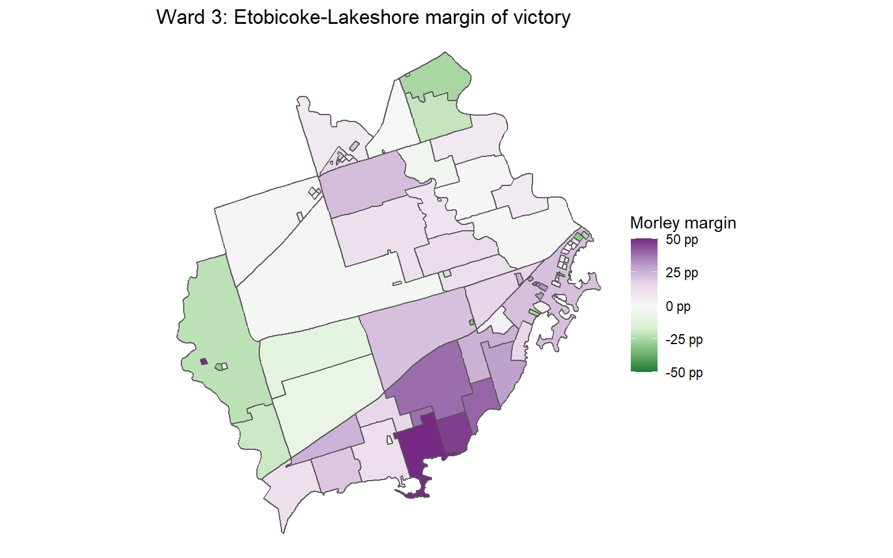

The cartogram gives a better picture of how Humber Bay Shores was close or leaned towards Grimes.

## Ward 4: Parkdale-High Park

Parkdale-High Park was a close three-way race between Gord Perks, Chemi Lhamo and Siri Agrell. There is a clear southeast/northwest divide in this ward, where Parkdale voted towards Lhamo, whereas High Park voted towards Perks.

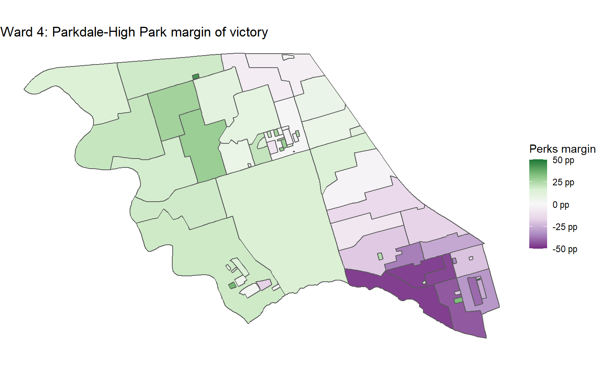

Cartogram reinforces how close it was.

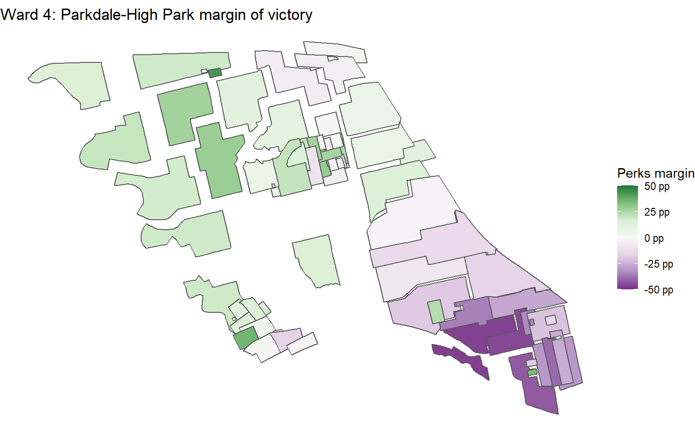

Because it was a three-way race, I also made popular vote maps for the three candidates.

First, Gord Perks definitely did better in the north and west part of the ward and was weak in Parkdale, with strongholds just north of High Park.

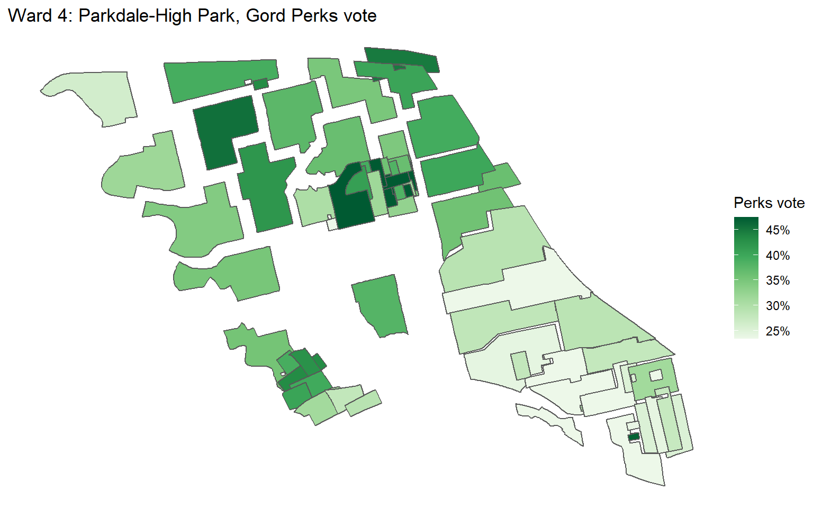

Chemi Lhamo did really well in dense Parkdale, but her vote share was very weak the further north and west you go.

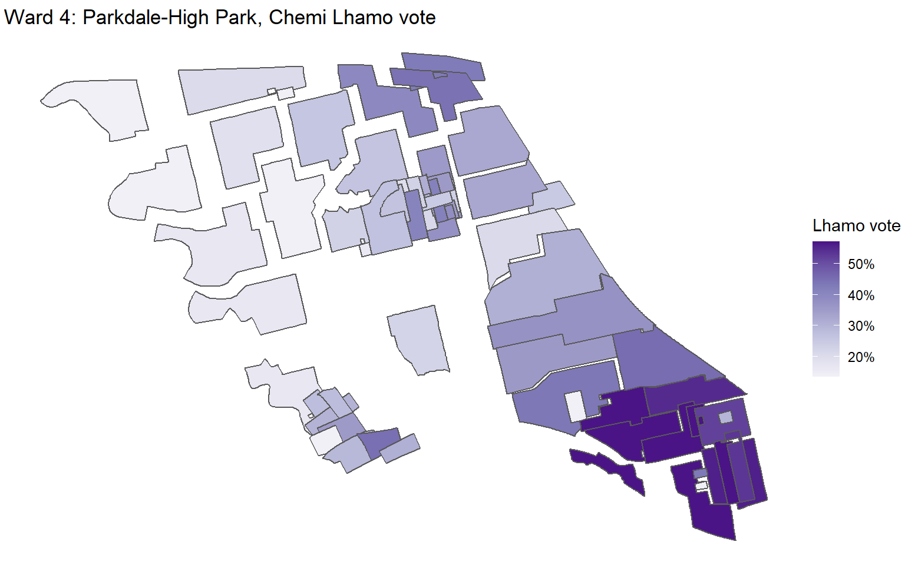

Siri Agrell was at her best in the very northwest of the ward, but it wasn't enough to make up for a weak performance overall, especially in Parkdale.

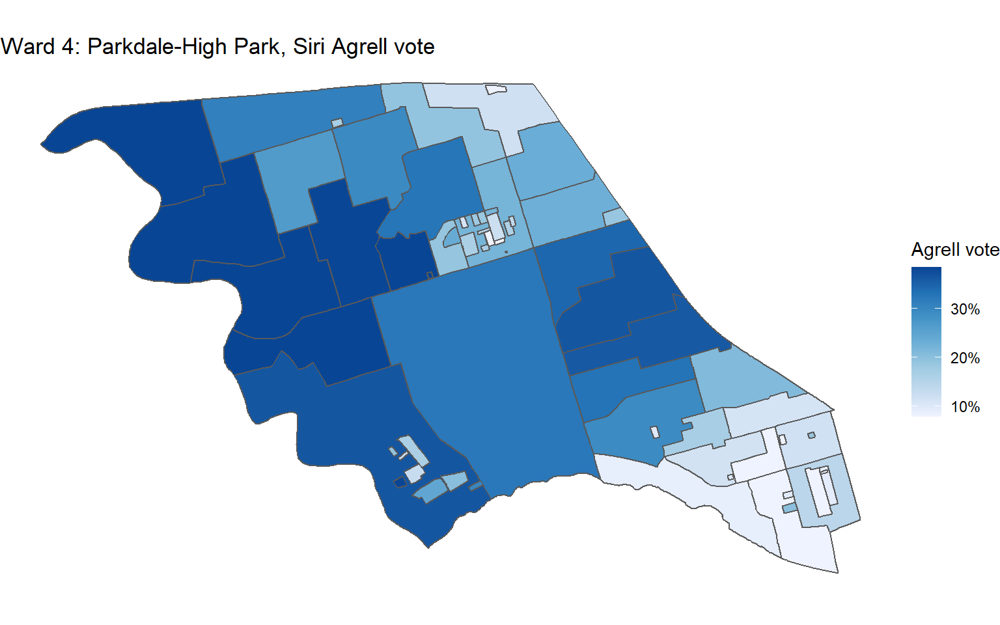

## Ward 5: York South-Weston

Chiara Padovani came close to beating Frances Nunziata. There is generally a trend where Nunziata did better in the northeast and Padovani did better in the south and west.

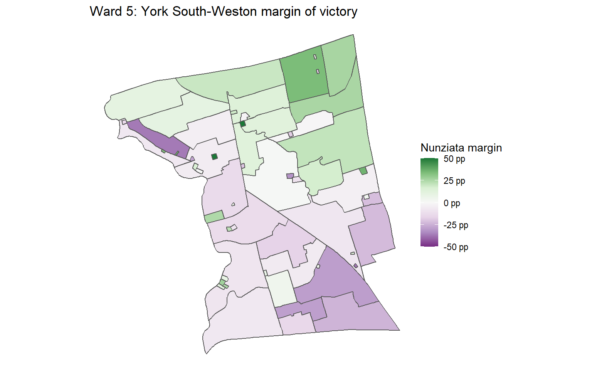

Not sure the cartogram is useful in this case, but here it is anyway

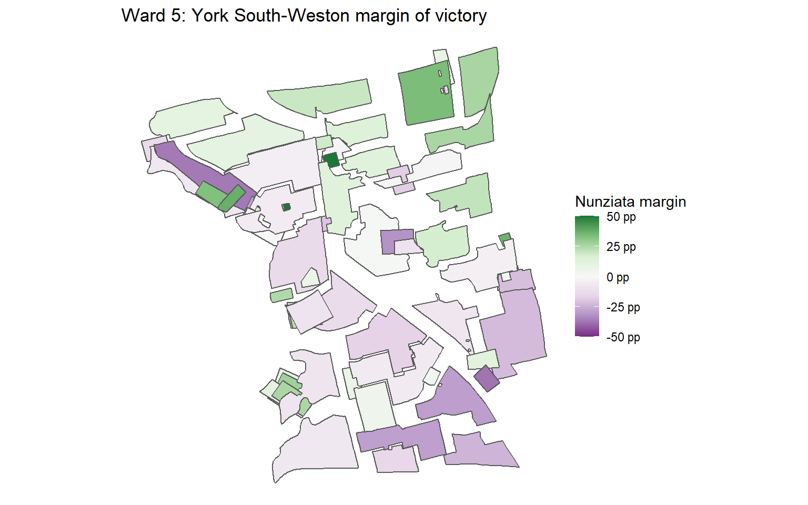

## Ward 11: University-Rosedale

Ward 11 was thought to be a three-way race between Dianne Saxe, Norm Di Pasquale, and Robin Buxton Potts, but Buxton Potts ended up not being competitive. The clear divide here is between the west and south part of the riding leaning more towards Di Pasquale, and the north and east part of the riding, the East Annex to Rosedale, voting more towards Saxe.

Cartogram shows just how close it was when you downscale relatively low density Rosedale.

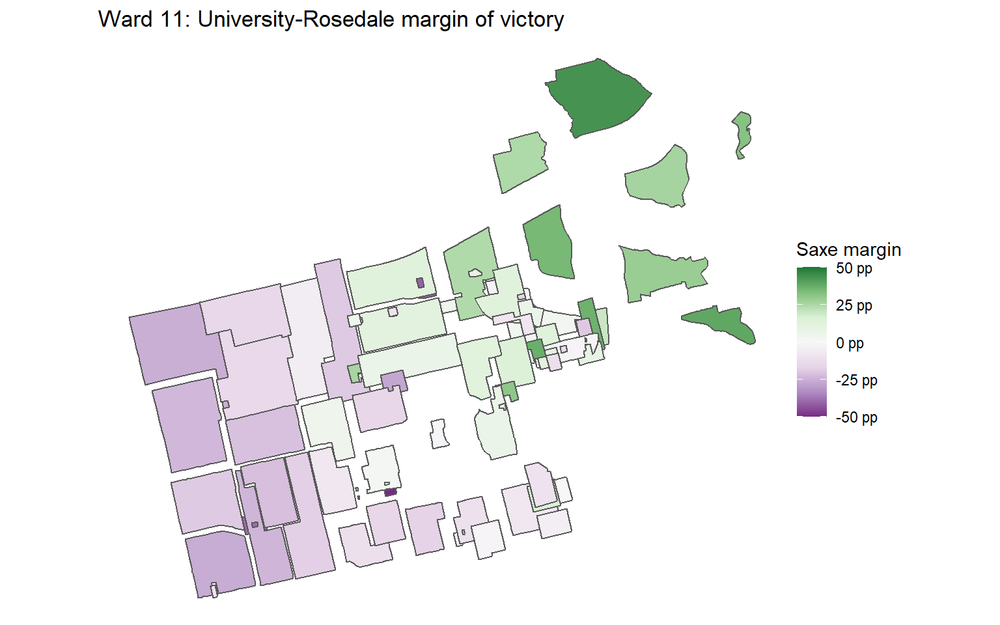

## Ward 18: Willowdale

At least for me, Willowdale was an upset ward. Markus O'Brien Fehr seemed to be better organized, had the backing of the mayor and the MP, had a solid ground game, was ahead in the polls, and Daniel Lee seemed to be splitting the Lily Cheng vote. Lily Cheng emerged victorious anyways, and it seems she did not have too many weak spots. While Cheng performed really well east of Yonge, O'Brien Fehr only came out ahead in a few places west of Yonge.

I don't think the cartograms are very insightful for this ward, so I'm just going to show one for the margin of victory.

Since there was a strong third-place candidate, here are the popular vote maps for each.

First, Lily Cheng.

Next, Markus O'Brien Fehr. He was strongest in the southwest.

Daniel Lee did best in the north.

## Ward 20: Scarborough-Southwest

Ward 20 was a close race between budget chief Gary Crawford and Parthi Kandavel who chased after the NIMBY vote by taking an anti-development platform.

Crawford did best in the north, especially north of the Lakeshore East tracks. Kandavel did best in the south, especially south of Kingston Road.

Cartogram show some Crawford holdouts in the south, probably some building-specific polls.

Kevin Rupasinghe who was endorsed by (almost?) all organizations who endorsed in this ward, did best from Kennedy to the western border of the ward.

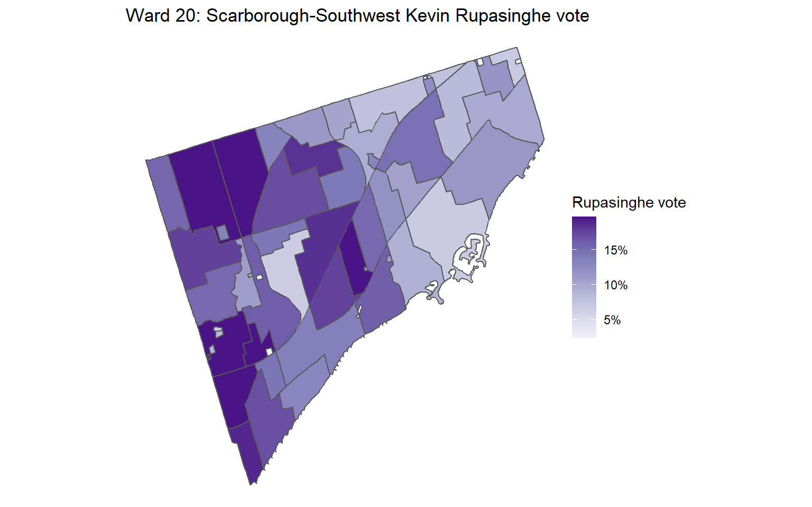

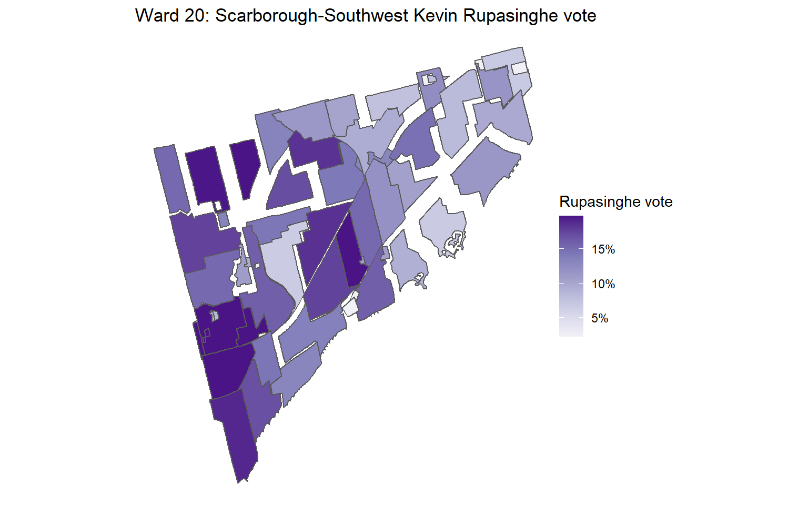

## Ward 23: Scarborough North

This ward is a special case. Cynthia Lai died a few days before the election, but it was too late to remove her name from the ballot. Her votes did not count. Using the standard tabulation, with zero votes for Lai, Jamaal Myers comes out ahead almost everywhere throughout the ward, with a strong base in the southeast.

The cartogram highlights three building-specific polls in the centre of the riding that Myers lost.

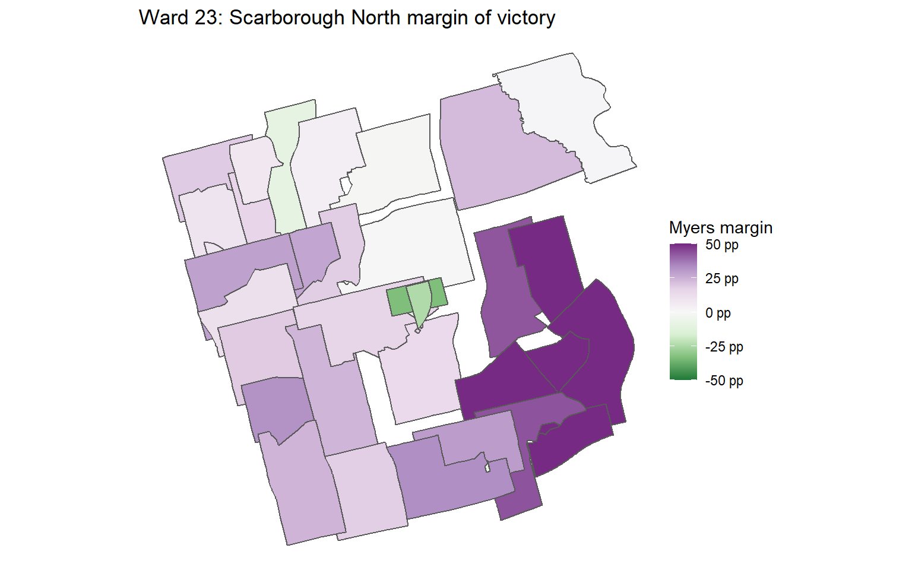

We can try to back out who voted for Lai by calculating a proxy: total mayoral votes minus total councillor votes. Compared to Lai, Myers still did better throughout the ward as it seems most people changed their vote from her, knowing that it would not count.

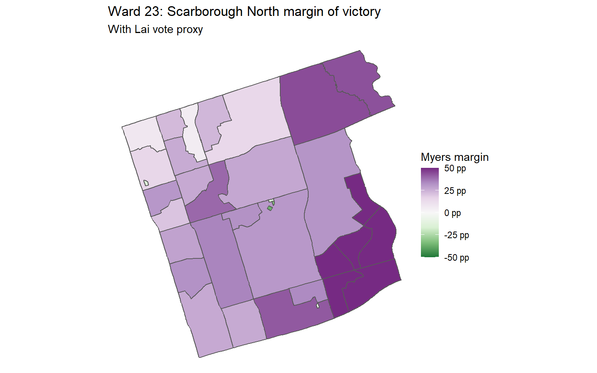

The cartogram again shows three building-specific polls that Myers loses versus Lai proxy votes.

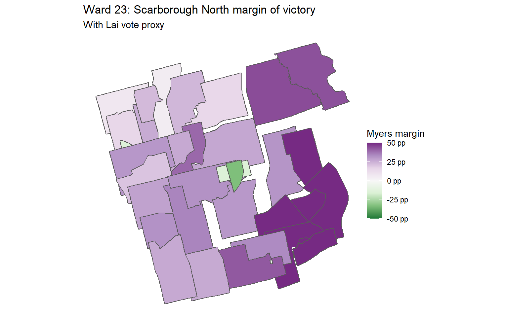

If we look at Lai's proxy popular vote, it's more or less distributed all over, but strongest in the north and west

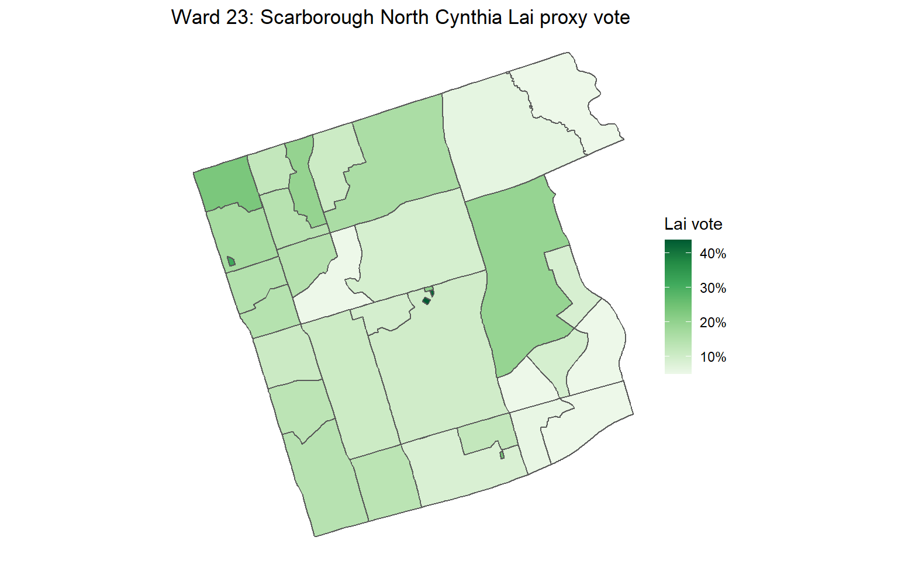

Cartogram highlights some strength for Lai proxy votes in those three building-specific polls.

Myers' vote, taking into account Lai proxy votes remains strongest in the southeast and weakest in the northwest.

