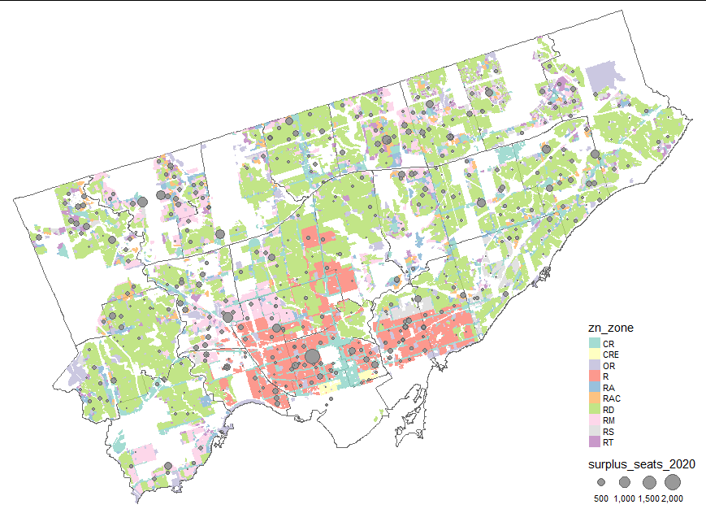
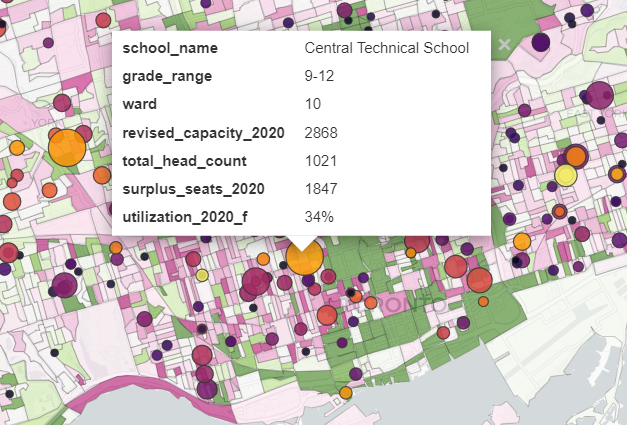

*tl;dr I made an [interactive map](https://jdawang.github.io/tdsb/) to visualize excess TDSB school capacity on top of population change and zoning*

## Motivation

In Toronto, like many places across Canada, schools are politicized.
In the past decades, Toronto's population has grown by a lot, and schools in some areas [have not been able to keep up](https://www.cbc.ca/news/canada/toronto/school-willowdale-overcrowding-education-tdsb-1.4379612).
Especially in the Toronto District School Board (TDSB), there is overcrowding and children are forced to enroll in schools that are farther from home than optimal.
Normally, school boards are allowed to levy development charges (EDC) on new housing developments to support new schools, but the TDSB is [not allowed to by law](https://www.tdsb.on.ca/About-Us/Accountability/Renewal-Needs-Backlog-and-Facility-Condition-Index/Education-Development-Charges) because it has excess capacity system-wide.
Some people have suggested that the solution to overcrowded schools is to simply [allow the TDSB to charge developers EDCs](https://twitter.com/maritstiles/status/1460206960675069952), that we could just fund new TDSB schools by eating into developers' profits.
There is a strong argument, however, that EDCs would simply either be passed along to new residents or make some housing development unviable.

I'm not going to wade into that argument in this post, but I want to propose a different solution: if the TDSB has excess capacity, we should build new housing where this capacity exists, instead of the current situation where some schools are underutilized and forced to close, but other neighbourhoods do not have enough schools.
But, where exactly does this capacity exist?

## Data

I went on a hunt for school data and found the TDSB's Long-term Planning and Accommodation Strategy document from 2021, which contains [data](https://www.tdsb.on.ca/Portals/0/aboutus/StrategyPlanning/LTPASSections/2021/10_%20Data.pdf) on school utilization.
Unfortunately, it is in PDF, so I emailed the TDSB asking if they could provide an Excel version of the document, and they were happy to oblige.
I linked this to the City of Toronto's [school locations](https://open.toronto.ca/dataset/school-locations-all-types/) dataset from their open data portal. All but three schools were linked.
I also incorporated Statistics Canada census population data, pulled using [Tongfen](https://github.com/mountainMath/tongfen) and Toronto's [zoning dataset](https://open.toronto.ca/dataset/zoning-by-law/) to add those layers on the map.

## Maps

The most useful map for people will be the interactive version, available at [jdawang.github.io/tdsb/](https://jdawang.github.io/tdsb/). I'll present a couple static maps in this section to make some observations.

The first map is surplus school seats plotted on top of population change 2016-2021, pink being areas that declined in population and green being areas that grew in population.

Overall, the underutilized schools are in neighbourhoods that declined in population, but that's an obvious conclusion.
Notably, despite the downtown core growing, some downtown-adjacent neighbourhoods in the west end such as Harbord Village and Dufferin Grove have schools with excess capacity.
There are also a few schools in the east, such as Cabbagetown and areas near the Danforth that have excess capacity.
These neighbourhoods have declined in population, despite being school-rich, service-rich and transit-rich.

Why not use this school capacity where it exists, instead of trying to build new schools with ever-increasing land and construction costs?
Like so many problems, we can look to zoning for the answer.
If you don't know much about zoning in Toronto, mapTO's [yellowbelt map](http://www.mapto.ca/maps/2017/3/4/the-yellow-belt) is a good place to start.

Schools with excess capacity are generally located in the RD zones and even the R zones.
While R zones technically allow apartments, it can be impossible to even build a triplex given floor-space index (FSI) rules and other regulations.
These are capital-N Neighbourhoods, areas which city planning does not expect to grow at all, even though the city as a whole is growing by a lot.
The result is that as land becomes more and more valuable, young families with children cannot access these school-rich neighbourhoods [and move out of the city](https://mikepmoffatt.medium.com/ontarians-on-the-move-2022-edition-b8ec483014d), simply because they cannot afford the luxury of a single-family home in the middle of Canada's largest city.

## A few specific schools

I can't help but note a few specific schools that have an enormous amount of surplus capacity.

First up is Central Technical School, more commonly known by its short name Central Tech, located in the centrally-located Harbord Village.
It has 1,800 surplus seats and is only 34% utilized.
It is an understatement to say that this is a huge campus.
I'm no schools expert, it's hard not to see how there is room around this school to welcome more neighbours and more children.

Central Tech is not alone, although most other schools count their surplus seats in the hundreds, instead of thousands.
We have George Harvey Collegiate Institute located not too far from the future Keelesdale station on the Eglinton LRT, with 900 empty seats.

The northern suburbs, such as Don Valley North also have schools with a large amount of surplus seats, such as Georges Vanier Secondary School with 700 empty seats.

## Final thoughts

Effectively, the City's approach to planning directs growth to areas without schools on purpose, driving overcrowding in some areas and surplus seats in others.
Instead of complaining about developers not paying their fair share, we should be looking at our zoning and planning policies that prioritize aesthetics over housing, and character over providing young families access to existing schools.
We could allow the TDSB the ability to charge EDCs, but this would be treating the symptom instead of the cause.
It would only be a bandaid on top of the real problem: our inequitable planning and zoning.

*My interactive map of TDSB schools can be found at [jdawang.github.io/tdsb/](https://jdawang.github.io/tdsb/)*

*Full code and data can be found on my [GitHub](https://github.com/jdawang/tdsb)*

*This is a blog version of a [twitter thread](https://twitter.com/jacoobaloo/status/1492912350629933057) I wrote:*


